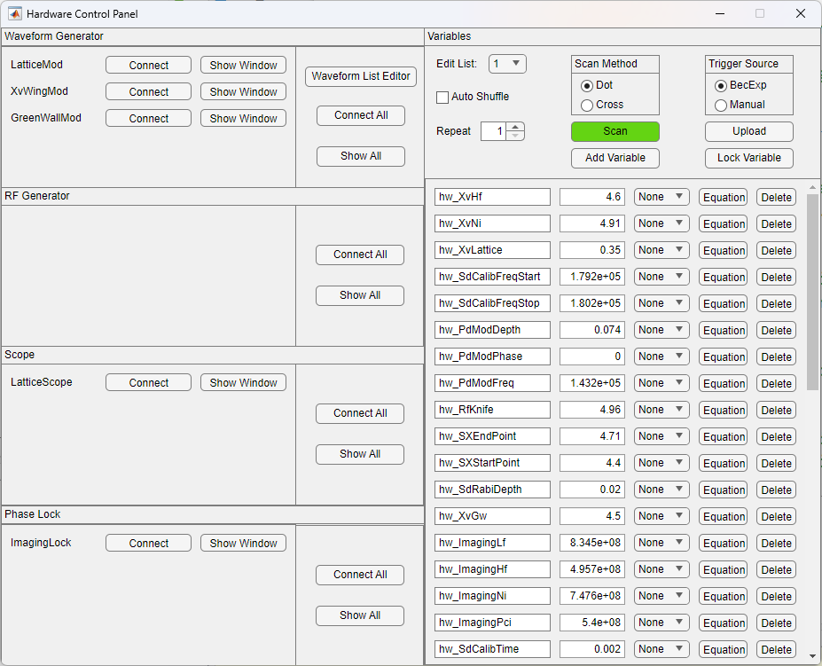
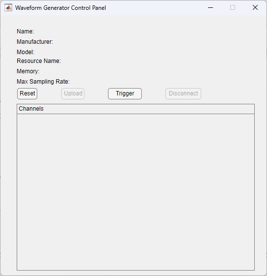
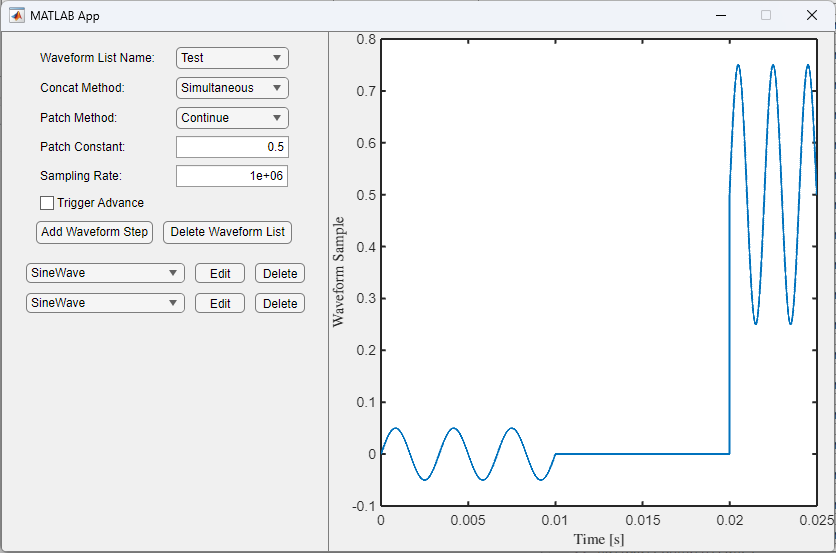
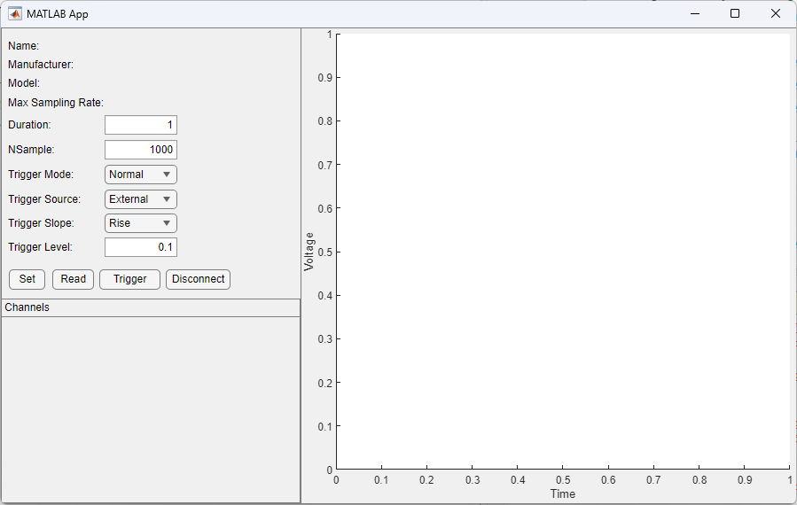
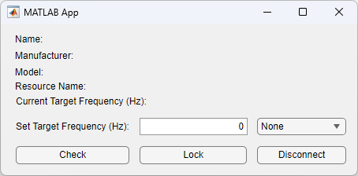

======================================

Hardware Control Panel and Related GUIs
--------------------------------------

Muscle Museum provides an intuitive GUI for controlling various electronic devices. The settings can be set up manually, at the start of each experiment, or scanned through each run iteration.

Devices currently supported include

* Keysight 336200A
* Keysight 335200A
* Spectrum DN2.663-02
* Vescent SLICE-OPL Offset Phase Lock Servo
* 

Hardware Control Panel
##########################

The Hardware Control Panel is the central GUI used to interface various devices. 

The components of the Hardware Control Panel include:

* Panels on the left to connect to various electronic devices and open GUIs to define settings for each one. They include waveform generators, scopes, and offset phase lock servos.
* A waveform list editor in the middle
* A list of defined variables in the bottom right that can be used for device settings. These can be bound to equations or lists and used for settings on different devices. 
* Controls at the top right to upload new settings and scan variables over different iterations of the runs. Clicking the dropdown for the lists allows you to open up a List Dialog window to a list of parameters.

Opening different devices open other GUIs for controlling the uploaded settings.

Waveform Generator
====================================

Waveform List Editor 
==========================

The Waveform List Editor contains a library of waveforms and options on how to concatenate different segments of the waveforms together for uploading to an Arbitrary Waveform Generator. 
One can specify the concatenation and patch method, as well as a default sampling rate. Trigger advance determines whether the AWG holds at each segment waiting for a trigger or immediately outputs all segments after the first trigger.
Parameters for each segment can be modified as needed by pressing the edit button, and the parameters can be bound to hardware variables.

Scope GUI
=================

Phase Lock GUI
==================

Setting Default Sequences through Bec Control Panel
#########################################################
The Bec Control Panel allows for configuring default setting uploads upon starting a new experimental trial. This can be done by 

Insert figure with BecControlPanel here.

Configuring New Devices
##########################

Important Classes for Hardware Control Panel
###################################################
This segment speaks more to the programming principles behind Muscle Museums operation of hardware control panels.
Each GUI of the hardware control panel modifies different classes to enable uploads of different parameters.
Variables are stored in MMUser Config 

The Waveform List Editor modifies a list of Waveform objects, controlled by the :class:`Waveform` class. This class is discussed in :ref:`waveform`.
