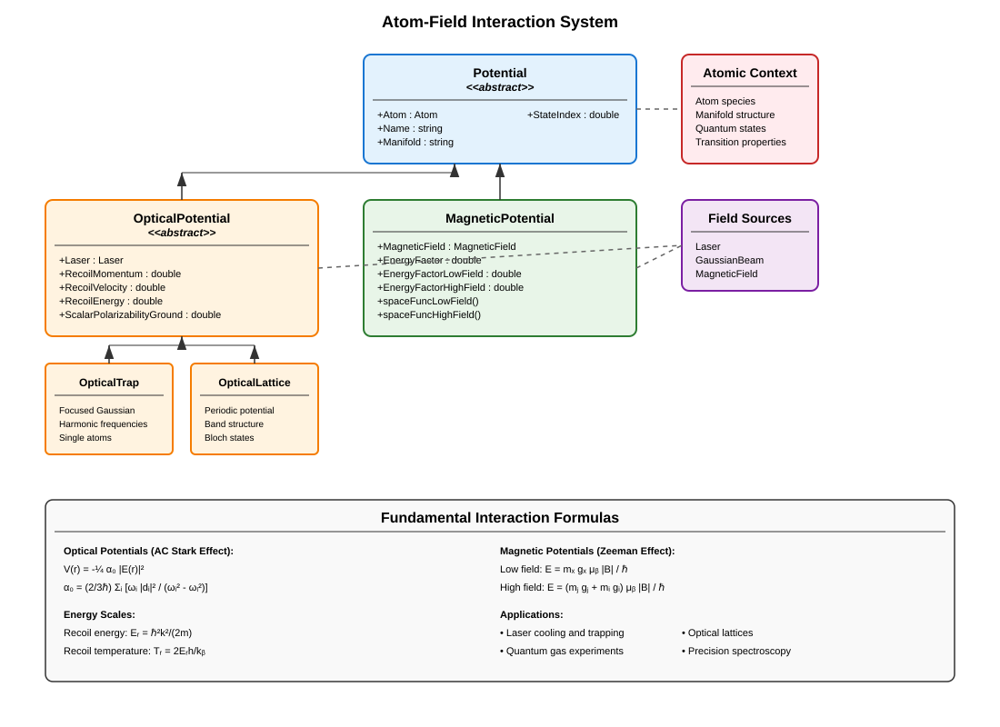

Interactions Between Atom and Field
====================================

The **atom-field interaction framework** provides comprehensive modeling of how electromagnetic fields interact with atomic systems to create trapping, cooling, and manipulation potentials. This system combines the atomic structure calculations with laser and magnetic field configurations to compute realistic interaction strengths and spatial potential landscapes.

Overview
--------

The interaction framework encompasses several types of atom-field couplings:

- **Optical potentials**: AC Stark shifts from laser intensity
- **Magnetic potentials**: Zeeman energy shifts from magnetic fields
- **Optical lattices**: Periodic potentials from standing wave interference
- **Optical traps**: Localized trapping from focused laser beams
- **Hybrid potentials**: Combined optical and magnetic interactions

These interactions form the basis for all atomic manipulation techniques in AMO physics, from laser cooling to quantum gas experiments.

Potential System Architecture
-----------------------------

Potential Base Class
--------------------

The :class:`Potential` abstract base class provides the foundation for all atom-field interactions:

**Core Properties:**

- :attr:`Atom`: Atomic species context for calculations
- :attr:`Name`: Human-readable potential identifier
- :attr:`Manifold`: Atomic manifold for the interaction
- :attr:`StateIndex`: Specific quantum state within the manifold

**Basic Construction:**

.. code-block:: matlab

   % All potentials require an atom context
   atom = Lithium7();
   
   % Concrete potentials specify field sources
   % (See OpticalTrap, OpticalLattice, MagneticPotential examples below)

Optical Potentials
------------------

OpticalPotential Base Class
^^^^^^^^^^^^^^^^^^^^^^^^^^^

The :class:`OpticalPotential` class handles laser-atom interactions through the AC Stark effect:

**Physical Principles:**

The optical potential arises from the AC Stark shift:

.. math::
   V(\mathbf{r}) = -\frac{1}{4} \alpha_0 |\mathbf{E}(\mathbf{r})|^2

where :math:`\alpha_0` is the scalar polarizability.

**Key Properties:**

- :attr:`Laser`: Driving laser field configuration
- :attr:`RecoilMomentum`: :math:`p_r = \hbar k` [kg·m/s]
- :attr:`RecoilVelocity`: :math:`v_r = p_r/m` [m/s]
- :attr:`RecoilEnergy`: :math:`E_r/h` [Hz]
- :attr:`RecoilTemperature`: :math:`T_r = 2 E_r h / k_B` [K]
- :attr:`ScalarPolarizabilityGround`: :math:`\alpha_0` [Hz/(V/m)²]

**Polarizability Calculation:**

The scalar polarizability includes contributions from both D1 and D2 transitions:

.. math::
   \alpha_0 = \frac{2}{3\hbar} \left( \frac{\omega_{D1} |d_{D1}|^2}{\omega_{D1}^2 - \omega_L^2} + \frac{\omega_{D2} |d_{D2}|^2}{\omega_{D2}^2 - \omega_L^2} \right)

.. code-block:: matlab

   % Polarizability automatically calculated from atomic data
   atom = Rubidium87();
   laser = Laser(wavelength = 1064e-9);  % Far-detuned IR laser
   
   opticalPot = OpticalTrap(atom, laser);
   alpha0 = opticalPot.ScalarPolarizabilityGround;  % [Hz/(V/m)²]

OpticalTrap Class
^^^^^^^^^^^^^^^^^

Focused Gaussian beam dipole traps for single atoms and small ensembles:

**Trap Properties:**

- :attr:`Depth`: Maximum trap depth [Hz]
- :attr:`AxialFrequency`: Axial harmonic frequency [Hz]
- :attr:`RadialFrequency`: Radial harmonic frequency [Hz]

**Scaling Relations:**

.. math::
   V_0 = \frac{|\alpha_0 E_0^2|}{4}

.. math::
   f_z = \frac{1}{2\pi}\sqrt{\frac{2 V_0}{m z_R^2}}

.. math::
   f_\rho = \frac{1}{2\pi}\sqrt{\frac{4 V_0}{m w^2}}

.. code-block:: matlab

   % Create optical dipole trap
   atom = Lithium7();
   trapBeam = GaussianBeam(waist = [30e-6; 30e-6], power = 100e-3, wavelength = 1064e-9);
   
   dipole_trap = OpticalTrap(atom, trapBeam, "MainTrap");
   
   % Calculate trap properties
   trap_depth = dipole_trap.Depth;              % [Hz]
   f_axial = dipole_trap.AxialFrequency;        % [Hz]
   f_radial = dipole_trap.RadialFrequency;      % [Hz]
   
   % Convert to convenient units
   depth_uK = trap_depth / Constants.SI("kB") * 1e6;  % [μK]
   
   fprintf('Trap depth: %.1f μK\n', depth_uK);
   fprintf('Axial frequency: %.1f Hz\n', f_axial);
   fprintf('Radial frequency: %.1f Hz\n', f_radial);

**Intensity Dependence:**

.. code-block:: matlab

   % Trap depth scales linearly with laser intensity
   powers = [10e-3, 50e-3, 100e-3, 200e-3];  % [W]
   depths = zeros(size(powers));
   
   for i = 1:length(powers)
       trapBeam.Power = powers(i);
       depths(i) = dipole_trap.Depth;
   end
   
   % Plot scaling relationship
   figure; plot(powers*1e3, depths/Constants.SI("kB")*1e6);
   xlabel('Laser Power [mW]'); ylabel('Trap Depth [μK]');

OpticalLattice Class
^^^^^^^^^^^^^^^^^^^^

Periodic optical potentials for quantum gas experiments:

**Lattice Properties:**

- :attr:`LatticeSpacing`: :math:`a = \lambda/2` [m]
- :attr:`Depth`: Lattice depth [Hz] from various calibrations
- :attr:`DepthLu`: Dimensionless depth in recoil units
- :attr:`AxialFrequency`: Axial trap frequency [Hz]
- :attr:`RadialFrequency`: Radial trap frequency [Hz]

**Multiple Depth Calibrations:**

.. code-block:: matlab

   atom = Lithium7();
   lattice_laser = Laser(wavelength = 1064e-9, intensity = 1e6);
   
   optical_lattice = OpticalLattice(atom, lattice_laser, "MainLattice");
   
   % Different depth calibration methods
   optical_lattice.DepthKd = 25 * 2*pi * 25e3;     % Kapitza-Dirac [Hz]
   optical_lattice.DepthSpec = 24 * 2*pi * 25e3;   % Spectroscopy [Hz]
   
   % Access best available depth
   depth_best = optical_lattice.Depth;         % [Hz]
   depth_recoil = optical_lattice.DepthLu;     % [E_r]

**Band Structure Calculations:**

.. code-block:: matlab

   % Lattice provides access to band structure
   lattice_spacing = optical_lattice.LatticeSpacing;  % λ/2
   
   % Recoil energy scale
   Er = optical_lattice.RecoilEnergy;  % [Hz]
   
   % Trap frequencies from lattice depth
   f_axial = optical_lattice.AxialFrequency;    % [Hz]
   f_radial = optical_lattice.RadialFrequency;  % [Hz]

**Advanced Lattice Features:**

.. code-block:: matlab

   % Band structure properties (when calculated)
   % band_energies = optical_lattice.BandEnergy;      % E_n(q)
   % bloch_states = optical_lattice.BlochState;       % ψ_n,q(x)
   % berry_connection = optical_lattice.BerryConnection; % Geometric phases

Magnetic Potentials
-------------------

MagneticPotential Class
^^^^^^^^^^^^^^^^^^^^^^^

Zeeman energy shifts from magnetic field interactions:

**Energy Regimes:**

The system automatically handles different magnetic field regimes:

**Low Field (Linear Zeeman):**

.. math::
   E = m_F g_F \mu_B |\mathbf{B}| / \hbar

**High Field (Paschen-Back):**

.. math::
   E = (m_J g_J + m_I g_I) \mu_B |\mathbf{B}| / \hbar

**Automatic Regime Selection:**

.. code-block:: matlab

   atom = Lithium7();
   magnetic_field = MagneticField(bias = [0; 0; 1e-4]);  % 1 G
   
   mag_potential = MagneticPotential(atom, magnetic_field, "MagTrap", ...
       manifold = "DGround", stateIndex = 1);
   
   % Energy factors automatically selected based on field strength
   alpha_effective = mag_potential.EnergyFactor;     % [Hz/T]
   alpha_low = mag_potential.EnergyFactorLowField;   % [Hz/T]
   alpha_high = mag_potential.EnergyFactorHighField; % [Hz/T]

**Spatial Potential Functions:**

.. code-block:: matlab

   % Generate spatial potential functions
   V_low_field = mag_potential.spaceFuncLowField();
   V_high_field = mag_potential.spaceFuncHighField();
   
   % Evaluate potential at specific positions
   positions = [0, 1e-3, 2e-3; 0, 0, 0; 0, 0, 0];  % [m]
   energies = V_low_field(positions);  % [Hz]
   
   % Convert to temperature units
   temperatures = energies / Constants.SI("kB");  % [K]

**Magnetic Trap Design:**

.. code-block:: matlab

   % Quadrupole magnetic trap
   grad_matrix = diag([10, 10, -20]) * 1e-2;  % [T/m]
   quad_field = MagneticField(gradient = grad_matrix);
   
   % Ioffe-Pritchard trap with bias
   ip_field = MagneticField(bias = [0; 0; 1e-4], gradient = grad_matrix);
   
   % Create magnetic potentials
   quad_trap = MagneticPotential(atom, quad_field, "Quadrupole");
   ip_trap = MagneticPotential(atom, ip_field, "IoeffePritchard");

Interaction Energy Scales
--------------------------

**Optical Interaction Strengths:**

.. code-block:: matlab

   atom = Rubidium87();
   
   % Red-detuned dipole trap (attractive)
   red_laser = Laser(wavelength = 1064e-9, intensity = 1e6);  % [W/m²]
   red_trap = OpticalTrap(atom, red_laser);
   
   depth_red = red_trap.Depth;  % Negative (attractive)
   
   % Blue-detuned dipole trap (repulsive)
   blue_laser = Laser(wavelength = 500e-9, intensity = 1e6);  % [W/m²]
   blue_trap = OpticalTrap(atom, blue_laser);
   
   depth_blue = blue_trap.Depth;  % Positive (repulsive)

**Magnetic Interaction Strengths:**

.. code-block:: matlab

   % Compare different atomic states
   f1_state = 1;  % F=1 manifold
   f2_state = 2;  % F=2 manifold
   
   mag_f1 = MagneticPotential(atom, magnetic_field, "F1_trap", stateIndex = f1_state);
   mag_f2 = MagneticPotential(atom, magnetic_field, "F2_trap", stateIndex = f2_state);
   
   alpha_f1 = mag_f1.EnergyFactor;  % [Hz/T]
   alpha_f2 = mag_f2.EnergyFactor;  % [Hz/T]
   
   % F=2 states are typically more strongly trapped

**Energy Scale Comparisons:**

.. code-block:: matlab

   % Compare optical vs. magnetic trapping strengths
   optical_depth = abs(red_trap.Depth);
   magnetic_depth = abs(mag_f2.EnergyFactor * norm(magnetic_field.Bias));
   
   fprintf('Optical trap depth: %.2f μK\n', optical_depth/Constants.SI("kB")*1e6);
   fprintf('Magnetic trap depth: %.2f μK\n', magnetic_depth/Constants.SI("kB")*1e6);

Advanced Interaction Calculations
----------------------------------

Hybrid Trapping Systems
^^^^^^^^^^^^^^^^^^^^^^^

Combining optical and magnetic potentials for enhanced control:

.. code-block:: matlab

   % Create hybrid trap system
   atom = Lithium7();
   
   % Optical component (weak confinement)
   optical_beam = GaussianBeam(waist = [100e-6; 100e-6], power = 50e-3, wavelength = 1064e-9);
   optical_component = OpticalTrap(atom, optical_beam, "OpticalGuide");
   
   % Magnetic component (strong confinement)
   magnetic_field = MagneticField(bias = [0; 0; 5e-4], gradient = diag([20, 20, -40])*1e-2);
   magnetic_component = MagneticPotential(atom, magnetic_field, "MagneticTrap");
   
   % Combined potential analysis
   V_optical = optical_component.Depth;
   V_magnetic = magnetic_component.EnergyFactor * norm(magnetic_field.Bias);
   
   % Determine dominant trapping mechanism
   if abs(V_optical) > abs(V_magnetic)
       dominant = "optical";
   else
       dominant = "magnetic";
   end

Multi-Species Interactions
^^^^^^^^^^^^^^^^^^^^^^^^^^

Handling different atomic species in the same fields:

.. code-block:: matlab

   % Different species in shared fields
   li7 = Lithium7();
   rb87 = Rubidium87();
   
   % Shared optical field
   shared_laser = Laser(wavelength = 1064e-9, intensity = 1e6);
   
   % Species-specific optical potentials
   li_optical = OpticalTrap(li7, shared_laser, "Li_Optical");
   rb_optical = OpticalTrap(rb87, shared_laser, "Rb_Optical");
   
   % Compare interaction strengths
   alpha_li = li_optical.ScalarPolarizabilityGround;
   alpha_rb = rb_optical.ScalarPolarizabilityGround;
   
   ratio = alpha_rb / alpha_li;
   fprintf('Rb/Li polarizability ratio: %.2f\n', ratio);

**Mass-Dependent Effects:**

.. code-block:: matlab

   % Recoil energies scale as 1/mass
   Er_li = li_optical.RecoilEnergy;   % [Hz]
   Er_rb = rb_optical.RecoilEnergy;   % [Hz]
   
   mass_ratio = rb87.mass / li7.mass;
   recoil_ratio = Er_li / Er_rb;
   
   % Verify scaling: recoil_ratio ≈ mass_ratio

State-Dependent Interactions
----------------------------

**Zeeman State Selection:**

.. code-block:: matlab

   atom = Rubidium87();
   magnetic_field = MagneticField(bias = [0; 0; 2e-4]);  % 2 G
   
   % Different magnetic sublevels
   mF_states = [-2, -1, 0, 1, 2];  % F=2 Zeeman sublevels
   
   for i = 1:length(mF_states)
       % Find state index for specific mF
       ground_states = atom.DGround.StateList;
       state_idx = find(ground_states.F == 2 & ground_states.MF == mF_states(i));
       
       % Create state-specific potential
       mag_pot = MagneticPotential(atom, magnetic_field, sprintf("mF_%d", mF_states(i)), ...
                                   stateIndex = state_idx);
       
       energy_factor = mag_pot.EnergyFactor;
       fprintf('mF = %d: α = %.2e Hz/T\n', mF_states(i), energy_factor);
   end

**Polarization-Dependent Optical Interactions:**

.. code-block:: matlab

   % Vector polarizability for different light polarizations
   % (Implementation depends on specific atomic structure)
   
   % Linear polarization
   linear_laser = Laser(wavelength = 780e-9, polarization = [1; 0; 0]);
   
   % Circular polarization  
   circular_laser = Laser(wavelength = 780e-9, polarization = [1; 1i; 0]/sqrt(2));

Lattice Physics Applications
----------------------------

**Band Structure and Tunneling:**

.. code-block:: matlab

   atom = Lithium7();
   lattice_laser = Laser(wavelength = 1064e-9, intensity = 5e5);
   
   lattice = OpticalLattice(atom, lattice_laser, "1D_Lattice");
   lattice.DepthKd = 10 * 2*pi * 25e3;  % 10 E_r depth
   
   % Lattice energy scales
   Er = lattice.RecoilEnergy;              % [Hz]
   lattice_depth = lattice.Depth;         % [Hz]
   depth_recoil = lattice_depth / Er;     % Dimensionless depth
   
   % Tunneling rate (tight-binding approximation)
   J_tunneling = 4 * Er / sqrt(pi) * (depth_recoil)^(3/4) * exp(-2*sqrt(depth_recoil));

**Harmonic Approximation:**

.. code-block:: matlab

   % Harmonic frequencies at lattice sites
   f_axial = lattice.AxialFrequency;     % Along lattice direction
   f_radial = lattice.RadialFrequency;   % Perpendicular to lattice
   
   % Harmonic oscillator length
   a_ho_axial = sqrt(Constants.SI("hbar") / (2*pi*f_axial) / atom.mass);
   a_ho_radial = sqrt(Constants.SI("hbar") / (2*pi*f_radial) / atom.mass);

Interaction Dynamics
--------------------

**Light Scattering:**

.. code-block:: matlab

   % Photon scattering rate
   atom = Rubidium87();
   laser_intensity = 1e3;  % [W/m²]
   
   saturation_intensity = atom.CyclerSaturationIntensity;
   natural_linewidth = atom.D2.NaturalLinewidth * 2*pi;  % [rad/s]
   
   saturation_parameter = laser_intensity / saturation_intensity;
   scattering_rate = natural_linewidth * saturation_parameter / (1 + saturation_parameter);
   
   % Heating rate from photon recoil
   recoil_energy = atom.D2.RecoilEnergy;
   heating_rate = scattering_rate * recoil_energy;  % [Hz²]

**Doppler Cooling:**

.. code-block:: matlab

   % Doppler cooling parameters
   T_doppler = atom.D2.DopplerTemperature;      % [K]
   v_capture = natural_linewidth / (2 * atom.D2.AngularWavenumber);  % [m/s]
   
   % Friction coefficient
   k = atom.D2.AngularWavenumber;
   beta = natural_linewidth * k^2 / 2;  % [kg/s]

**AC Stark Shift Calculations:**

.. code-block:: matlab

   % Detailed AC Stark shift calculation
   laser = Laser(wavelength = 1064e-9, intensity = 1e6);
   
   % Detunings from atomic transitions
   omega_laser = laser.AngularFrequency;
   omega_D1 = atom.D1.Frequency * 2*pi;
   omega_D2 = atom.D2.Frequency * 2*pi;
   
   delta_D1 = omega_laser - omega_D1;  % Detuning from D1
   delta_D2 = omega_laser - omega_D2;  % Detuning from D2
   
   % AC Stark shift contributions
   shift_D1 = (laser.ElectricFieldAmplitude^2 / 4) * alpha_D1 / delta_D1;
   shift_D2 = (laser.ElectricFieldAmplitude^2 / 4) * alpha_D2 / delta_D2;

Experimental Applications
-------------------------

**BEC Formation:**

.. code-block:: matlab

   % Evaporative cooling in magnetic trap
   atom = Rubidium87();
   evap_field = MagneticField(bias = [0; 0; 2e-4]);  % Initial 2 G bias
   
   mag_trap = MagneticPotential(atom, evap_field, "EvapTrap");
   
   % Calculate trap depth for different field strengths
   field_strengths = linspace(0.5e-4, 2e-4, 20);  % [T]
   trap_depths = zeros(size(field_strengths));
   
   for i = 1:length(field_strengths)
       evap_field.Bias = [0; 0; field_strengths(i)];
       trap_depths(i) = mag_trap.EnergyFactor * field_strengths(i);
   end
   
   % Convert to temperature
   trap_temps = trap_depths / Constants.SI("kB") * 1e6;  % [μK]

**Optical Lattice Loading:**

.. code-block:: matlab

   % Adiabatic lattice loading sequence
   atom = Lithium7();
   
   % Initial dipole trap
   loading_beam = GaussianBeam(waist = [50e-6; 50e-6], power = 200e-3, wavelength = 1064e-9);
   loading_trap = OpticalTrap(atom, loading_beam, "Loader");
   
   % Target lattice
   lattice_beam = Laser(wavelength = 1064e-9, intensity = 1e5);
   target_lattice = OpticalLattice(atom, lattice_beam, "Target");
   
   % Compare energy scales for adiabatic loading
   trap_freq = loading_trap.RadialFrequency;
   lattice_freq = target_lattice.RadialFrequency;
   
   adiabatic_criterion = trap_freq / lattice_freq;  % Should be << 1

Best Practices
--------------

**Atomic Data Validation:**
- Cross-check calculated properties with experimental values
- Verify energy level ordering and transition frequencies
- Confirm that matrix elements satisfy selection rules

**Interaction Strength Estimation:**
- Calculate realistic field parameters for experimental conditions
- Consider decoherence and heating mechanisms
- Validate trap depths against thermal energy scales

**Numerical Precision:**
- Use appropriate precision for quantum mechanical calculations
- Be aware of numerical limitations in matrix diagonalization
- Validate orthogonality of quantum states

**Physical Consistency:**
- Ensure energy conservation in interaction calculations
- Check that calculated forces are physically reasonable
- Verify that trap frequencies match harmonic approximations

**Performance Optimization:**
- Cache expensive atomic structure calculations
- Use pre-calculated manifold data when possible
- Consider vectorization for parameter sweeps

The atom-field interaction framework provides the essential coupling between atomic structure and electromagnetic fields, enabling precise modeling of all atomic manipulation techniques used in modern AMO physics experiments. Its integration with accurate atomic data ensures quantitative agreement with experimental observations while providing the flexibility needed for exploring new interaction regimes.
