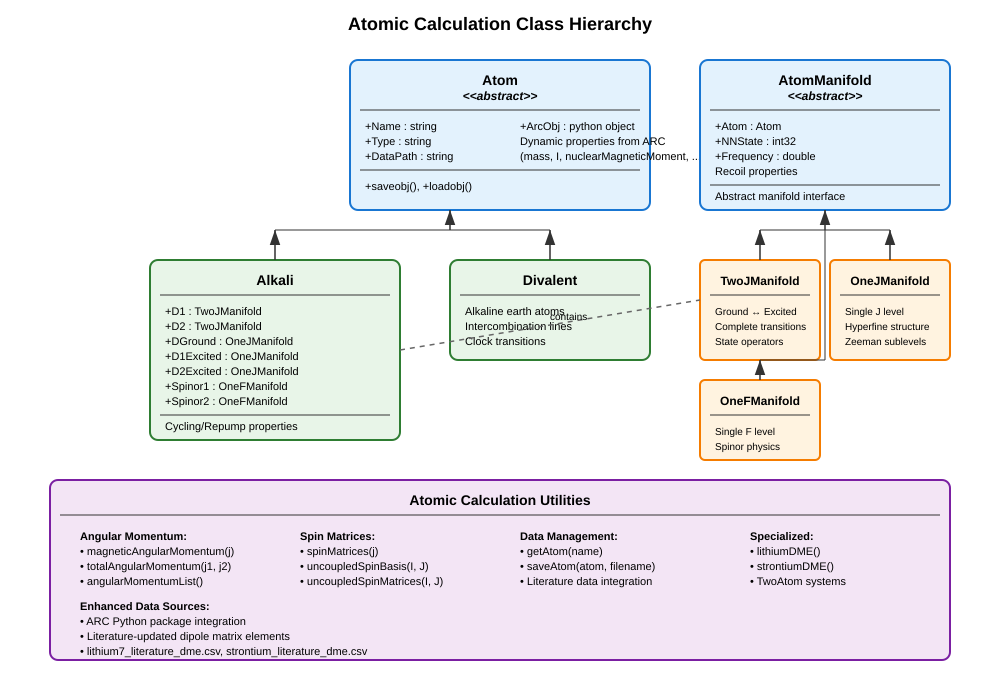

Atomic Property Calculation
============================

The **atomic calculation framework** in MuscleMuseum provides comprehensive tools for computing atomic structure, transition properties, and quantum mechanical operators for alkali and divalent atoms. Built upon the well-established `ARC (Alkali Rydberg Calculator) <https://arc-alkali-rydberg-calculator.readthedocs.io/en/latest/>`_ Python package, it offers precise atomic data with enhanced accuracy for specific isotopes and transitions.

Overview
--------

The atomic framework enables detailed calculations of:

- **Atomic structure**: Hyperfine manifolds, energy levels, and quantum numbers
- **Transition properties**: Frequencies, linewidths, and dipole matrix elements
- **Magnetic interactions**: Zeeman shifts and Landé :math:`g`-factors
- **Optical properties**: Saturation intensities, cross-sections, and polarizabilities
- **Quantum operators**: Angular momentum matrices and state transformations
- **Recoil dynamics**: Momentum transfer and temperature scales

The system supports both alkali atoms (Li, Na, K, Rb, Cs) and divalent atoms (Ca, Sr, Mg) with accurate experimental data integration.

Atomic Class Hierarchy
----------------------

Core Atom Classes
-----------------

Atom Abstract Base
^^^^^^^^^^^^^^^^^^

The :class:`Atom` abstract base class provides the foundation for all atomic calculations:

**Key Properties:**

- :attr:`Name`: Atomic species identifier (e.g., "Lithium7", "Rubidium87")
- :attr:`Type`: Classification as "Alkali" or "Divalent"
- :attr:`DataPath`: Storage location for pre-calculated atomic data
- **Dynamic Properties**: All ARC atomic constants mirrored as MATLAB properties

**ARC Integration:**

.. code-block:: matlab

   % Automatic ARC integration
   atom = Lithium7();  % Creates ARC object internally
   
   % Access fundamental atomic properties
   mass = atom.mass;                    % Atomic mass [kg]
   nuclearSpin = atom.I;               % Nuclear spin
   magneticMoment = atom.nuclearMagneticMoment; % Nuclear magnetic moment

**Data Management:**

.. code-block:: matlab

   % Atomic data automatically cached for performance
   dataPath = atom.DataPath;  % ~/Documents/MMUser/atomData/
   
   % Pre-calculated data includes:
   % - State mapping tables
   % - Transition matrix elements  
   % - Quantum operator matrices

Alkali Class
^^^^^^^^^^^^

The :class:`Alkali` class specializes in alkali atom calculations with complete D-line manifold structure:

**Manifold Properties:**

- :attr:`D1`: D1 transition manifold (:math:`J=1/2 \leftrightarrow J=1/2`)
- :attr:`D2`: D2 transition manifold (:math:`J=1/2 \leftrightarrow J=3/2`)
- :attr:`DGround`: Ground state manifold (:math:`L=0, J=1/2`)
- :attr:`D1Excited`: D1 excited manifold (:math:`L=1, J=1/2`)
- :attr:`D2Excited`: D2 excited manifold (:math:`L=1, J=3/2`)

**Spinor Manifolds:**

- :attr:`Spinor1`: Lower hyperfine ground manifold
- :attr:`Spinor2`: Upper hyperfine ground manifold

**Transition Properties:**

- :attr:`CyclerFrequency`: Cycling transition frequency [Hz]
- :attr:`CyclerSaturationIntensity`: Cycling saturation intensity [W/m²]
- :attr:`RepumperFrequency`: Repump transition frequency [Hz]
- :attr:`RepumperSaturationIntensity`: Repump saturation intensity [W/m²]

**Basic Usage:**

.. code-block:: matlab

   % Create alkali atom
   rb87 = Rubidium87();
   
   % Access D-line properties
   d2_freq = rb87.CyclerFrequency;              % ~384 THz
   d2_wavelength = rb87.D2.Wavelength;          % ~780 nm
   d2_linewidth = rb87.D2.NaturalLinewidth;    % ~6 MHz
   
   % Saturation intensities
   isat_cycling = rb87.CyclerSaturationIntensity;     % [W/m²]
   isat_cycling_lu = rb87.CyclerSaturationIntensityLu; % [mW/cm²]

**Cross-Section Calculations:**

.. code-block:: matlab

   % Resonant absorption cross-section
   sigma_cycling = rb87.CyclerCrossSection;     % [m²]
   sigma_repump = rb87.RepumperCrossSection;    % [m²]
   
   % Cross-section formula: σ = ℏωΓ/(2I_sat)
   % where Γ is the natural linewidth

Divalent Class
^^^^^^^^^^^^^^

The :class:`Divalent` class handles alkaline earth atoms with their unique electronic structure:

.. code-block:: matlab

   % Create divalent atom
   sr88 = Strontium88();
   
   % Access intercombination line properties
   % (Implementation details depend on specific divalent structure)

AtomManifold System
-------------------

The manifold system provides detailed quantum state structure and operators for atomic calculations.

AtomManifold Base Class
^^^^^^^^^^^^^^^^^^^^^^^

**Fundamental Properties:**

- :attr:`Atom`: Parent atom context
- :attr:`NNState`: Total number of quantum states
- :attr:`Frequency`: Center-of-gravity transition frequency

**Recoil Properties:**

- :attr:`RecoilMomentum`: :math:`p_r = \hbar k` [kg·m/s]
- :attr:`RecoilVelocity`: :math:`v_r = p_r/m` [m/s]  
- :attr:`RecoilEnergy`: :math:`E_r/h` [Hz]
- :attr:`RecoilTemperature`: :math:`T_r = 2 E_r h / k_B` [K]

.. code-block:: matlab

   % Access recoil properties from any manifold
   manifold = atom.D2;
   
   recoil_momentum = manifold.RecoilMomentum;      % [kg·m/s]
   recoil_velocity = manifold.RecoilVelocity;      % [m/s]
   recoil_energy = manifold.RecoilEnergy;          % [Hz]
   recoil_temp = manifold.RecoilTemperature;       % [K]

TwoJManifold Class
^^^^^^^^^^^^^^^^^^

Handles ground-excited state transitions with complete hyperfine structure:

**Quantum Numbers:**

- **Ground State**: :math:`n_g, L_g, J_g, F_g, M_{F_g}`
- **Excited State**: :math:`n_e, L_e, J_e, F_e, M_{F_e}`

**State Lists and Operators:**

.. code-block:: matlab

   d2 = atom.D2;
   
   % Complete state information
   stateList = d2.StateList;  % Table with all quantum numbers
   
   % State properties include:
   % - Index: State identifier
   % - F, MF: Hyperfine quantum numbers
   % - Energy: Hyperfine energy [Hz]
   % - gF: Landé g-factor
   
   % Access specific states
   groundStates = stateList(stateList.IsGround == true, :);
   excitedStates = stateList(stateList.IsGround == false, :);

**Quantum Operators:**

.. code-block:: matlab

   % Angular momentum operators
   Jx = d2.JOperator{1};  % Electronic angular momentum x-component
   Jy = d2.JOperator{2};  % y-component
   Jz = d2.JOperator{3};  % z-component
   
   Ix = d2.IOperator{1};  % Nuclear angular momentum x-component
   Iy = d2.IOperator{2};  % y-component
   Iz = d2.IOperator{3};  % z-component
   
   Fx = d2.FOperator{1};  % Total angular momentum x-component
   Fy = d2.FOperator{2};  % y-component
   Fz = d2.FOperator{3};  % z-component

**Transition Properties:**

.. code-block:: matlab

   % Linewidth and lifetime
   gamma = d2.NaturalLinewidth;        % [Hz]
   lifetime = d2.LifetimeExcited;      % [s]
   
   % Dipole matrix elements
   dme_reduced = d2.ReducedDipoleMatrixElement; % [C·m]
   
   % Saturation intensity
   isat_reduced = d2.ReducedSaturationIntensity; % [W/m²]

**Specific Transition Analysis:**

.. code-block:: matlab

   % Saturation intensity for specific transition
   F_ground = 2;    % Ground hyperfine state
   mF_ground = 0;   % Ground magnetic sublevel
   F_excited = 3;   % Excited hyperfine state  
   mF_excited = 0;  % Excited magnetic sublevel
   
   isat_specific = d2.SaturationIntensity(F_ground, mF_ground, F_excited, mF_excited);

Magnetic Field Interactions
---------------------------

**Zeeman Effect Calculations:**

.. code-block:: matlab

   % Bias field Hamiltonian
   magneticField = MagneticField(bias = [0; 0; 1e-4]); % 1 G along z
   
   % Compute Zeeman Hamiltonian
   H_zeeman = d2.HamiltonianAtomBiasField(magneticField);
   
   % Diagonalize for dressed states
   [eigenVecs, eigenVals] = eig(H_zeeman);
   
   % Get dressed state table
   [dressedStateTable, U] = d2.BiasDressedStateList(magneticField);

**Landé g-Factor Calculations:**

.. code-block:: matlab

   % Access g-factors for different states
   gF_ground = d2.LandegFGround;    % Hyperfine g-factors (ground)
   gF_excited = d2.LandegFExcited;  % Hyperfine g-factors (excited)
   
   gJ_ground = d2.LandegJGround;    % Electronic g-factors (ground)
   gJ_excited = d2.LandegJExcited;  % Electronic g-factors (excited)

Specialized Manifold Classes
----------------------------

OneJManifold Class
^^^^^^^^^^^^^^^^^^

Single J manifold for ground or excited states:

.. code-block:: matlab

   % Ground state manifold
   ground = atom.DGround;
   
   % Hyperfine structure
   F_values = ground.F;           % Available F quantum numbers
   energy_hfs = ground.Energy;    % Hyperfine energies [Hz]
   
   % Magnetic properties
   gF_values = ground.LandegF;    % Landé g-factors per F state

OneFManifold Class
^^^^^^^^^^^^^^^^^^

Single F manifold for spinor physics:

.. code-block:: matlab

   % Access spinor manifolds
   spinor1 = atom.Spinor1;  % Lower F manifold
   spinor2 = atom.Spinor2;  % Upper F manifold
   
   % Spinor-specific calculations
   % (Used for spinor BEC and quantum magnetism studies)

Utility Functions
-----------------

Angular Momentum Utilities
^^^^^^^^^^^^^^^^^^^^^^^^^^^

.. code-block:: matlab

   % Generate magnetic quantum numbers
   j = 3/2;
   mj_list = magneticAngularMomentum(j);  % [-3/2, -1/2, 1/2, 3/2]
   
   % Total angular momentum coupling
   j1 = 1/2; j2 = 1;
   F_possible = totalAngularMomentum(j1, j2);  % [1/2, 3/2]

**Spin Matrix Generation:**

.. code-block:: matlab

   % Generate spin matrices for arbitrary j
   j = 1;
   [Sx, Sy, Sz] = spinMatrices(j);
   
   % Uncoupled spin basis transformations
   basis = uncoupledSpinBasis(I, J);
   transformation = uncoupledSpinBasisTransformation(I, J);

Atomic Data Management
----------------------

**Species Loading:**

.. code-block:: matlab

   % Load atomic species
   atom = getAtom("Lithium7");    % Generic loader
   atom = Lithium7();             % Direct constructor
   
   % Save atomic calculations
   saveAtom(atom, "myCalculations");

**Literature Data Integration:**

The framework includes enhanced atomic data:

- **Lithium-7**: Updated dipole matrix elements from literature
- **Strontium**: Intercombination line data
- **Custom data files**: CSV format for additional isotopes

**Data Validation:**

.. code-block:: matlab

   % Verify atomic data consistency
   % Check sum rules for matrix elements
   % Validate energy level ordering
   % Confirm transition selection rules

Advanced Calculations
---------------------

Multi-Atom Systems
^^^^^^^^^^^^^^^^^^

.. code-block:: matlab

   % Two-atom calculations
   atom1 = Lithium7();
   atom2 = Lithium7();
   
   twoAtomSystem = TwoAtom(atom1, atom2);
   
   % Inter-atomic interactions
   % Collision cross-sections
   % Feshbach resonances

**Hyperfine Structure Analysis:**

.. code-block:: matlab

   % Detailed hyperfine analysis
   atom = Rubidium87();
   
   % Hyperfine coefficients
   A_ground = atom.DGround.HFSCoefficientA;     % Magnetic dipole [Hz]
   B_ground = atom.DGround.HFSCoefficientB;     % Electric quadrupole [Hz]
   
   % Energy level calculations
   F_values = atom.DGround.F;
   energies = atom.DGround.Energy;
   
   % Hyperfine splitting
   hfs_splitting = max(energies) - min(energies);  % [Hz]

**State-Specific Properties:**

.. code-block:: matlab

   % Access properties for specific quantum states
   stateList = atom.D2.StateList;
   
   % Find specific state
   target_state = stateList(stateList.F == 2 & stateList.MF == 0, :);
   state_energy = target_state.Energy;
   state_gF = target_state.gF;

Temperature and Energy Scales
-----------------------------

**Doppler Cooling Limits:**

.. code-block:: matlab

   % Doppler temperature
   T_doppler = atom.D2.DopplerTemperature;  % [K]
   
   % Convert to other units
   T_doppler_uK = T_doppler * 1e6;          % [μK]
   T_doppler_nK = T_doppler * 1e9;          % [nK]

**Recoil Energy Scales:**

.. code-block:: matlab

   % Recoil energy for different transitions
   Er_D1 = atom.D1.RecoilEnergy;           % [Hz]
   Er_D2 = atom.D2.RecoilEnergy;           % [Hz]
   
   % Recoil temperature
   Tr_D2 = atom.D2.RecoilTemperature;      % [K]
   
   % Recoil velocity
   vr_D2 = atom.D2.RecoilVelocity;         % [m/s]

**Energy Unit Conversions:**

.. code-block:: matlab

   % Convert between energy units
   energy_hz = 1e6;  % 1 MHz
   
   energy_joules = energy_hz * Constants.SI("hbar") * 2 * pi;
   energy_kelvin = energy_joules / Constants.SI("kB");
   energy_wavenumber = energy_joules / Constants.SI("hbar") / Constants.SI("c") / 2 / pi;

Transition Matrix Elements
--------------------------

**Dipole Matrix Elements:**

.. code-block:: matlab

   % Reduced dipole matrix elements
   d_D1 = atom.D1.ReducedDipoleMatrixElement;  % [C·m]
   d_D2 = atom.D2.ReducedDipoleMatrixElement;  % [C·m]
   
   % State-specific matrix elements
   % <F',mF'|d·ε|F,mF> for specific polarization ε

**Wigner-Eckart Theorem:**

.. code-block:: matlab

   % Matrix elements factorize as:
   % <F',mF'|T_q^k|F,mF> = (-1)^(F'-mF') * 
   %   * wigner3j(F', k, F, -mF', q, mF) 
   %   * <F'||T^k||F>
   
   % Reduced matrix elements are state-independent
   % Angular dependence from Wigner 3j symbols

Practical Applications
----------------------

**Laser Cooling Calculations:**

.. code-block:: matlab

   atom = Rubidium87();
   
   % Doppler cooling limit
   T_doppler = atom.D2.DopplerTemperature;
   
   % Scattering rate calculation
   laser_intensity = 1e3;  % [W/m²]
   saturation_intensity = atom.CyclerSaturationIntensity;
   
   saturation_parameter = laser_intensity / saturation_intensity;
   gamma = atom.D2.NaturalLinewidth * 2 * pi;  % [rad/s]
   
   scattering_rate = gamma * saturation_parameter / (1 + saturation_parameter);

**Optical Molasses Analysis:**

.. code-block:: matlab

   % Friction coefficient for optical molasses
   k = atom.D2.AngularWavenumber;
   beta = gamma * k^2 / 2;  % Friction coefficient
   
   % Capture velocity
   v_capture = gamma / (2 * k);

**Magnetic Trapping:**

.. code-block:: matlab

   % Trappable states (positive μ·B interaction)
   ground_states = atom.DGround.StateList;
   trappable = ground_states(ground_states.gF > 0 & ground_states.MF > 0, :);
   
   % Zeeman shift calculation
   magnetic_field = 1e-4;  % 1 G in Tesla
   zeeman_shift = trappable.gF * Constants.SI("muB") * magnetic_field / Constants.SI("hbar") / 2 / pi;

Best Practices
--------------

**Data Accuracy:**
- Use updated literature values when available
- Verify calculations against experimental measurements
- Cross-check with multiple sources for critical parameters

**Performance:**
- Cache expensive calculations for repeated use
- Use pre-calculated manifold data when possible
- Consider memory usage for large state spaces

**Numerical Precision:**
- Use appropriate numerical precision for quantum calculations
- Be aware of floating-point limitations in matrix diagonalization
- Validate orthogonality and normalization of quantum states

**Physical Validation:**
- Check that calculated properties match known experimental values
- Verify energy level ordering and selection rules
- Confirm that matrix elements satisfy sum rules

The atomic calculation framework provides the fundamental quantum mechanical foundation for all atom-light interactions in the MuscleMuseum system. Its integration with the established ARC database ensures accuracy while providing the flexibility needed for advanced AMO physics calculations.
