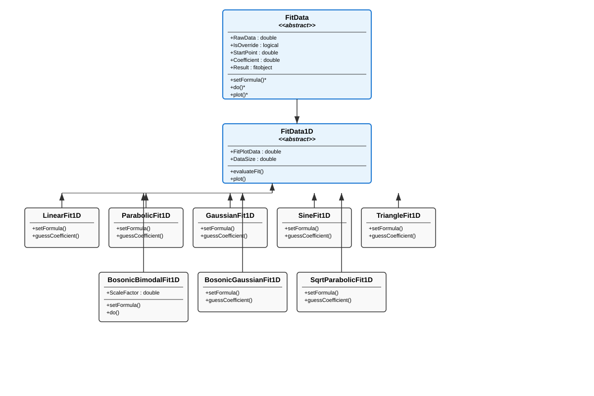
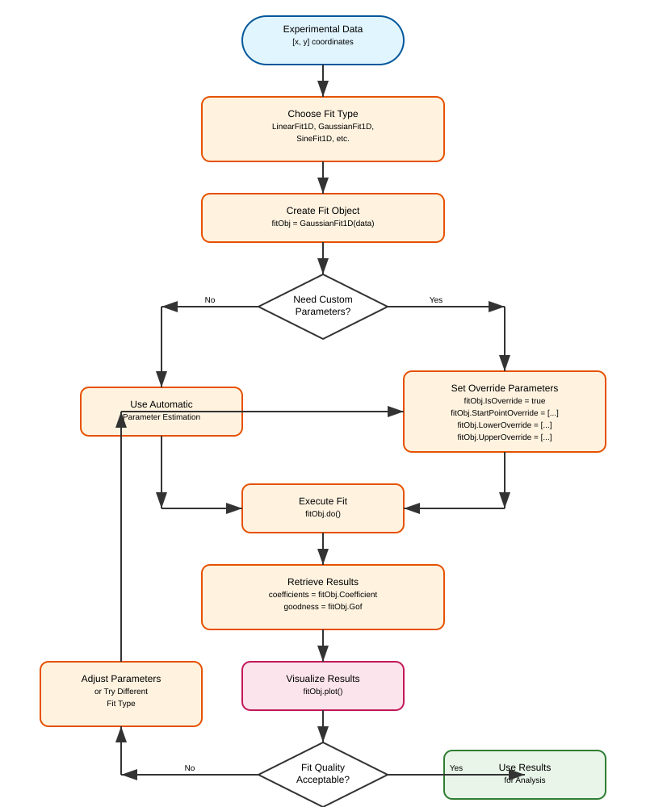
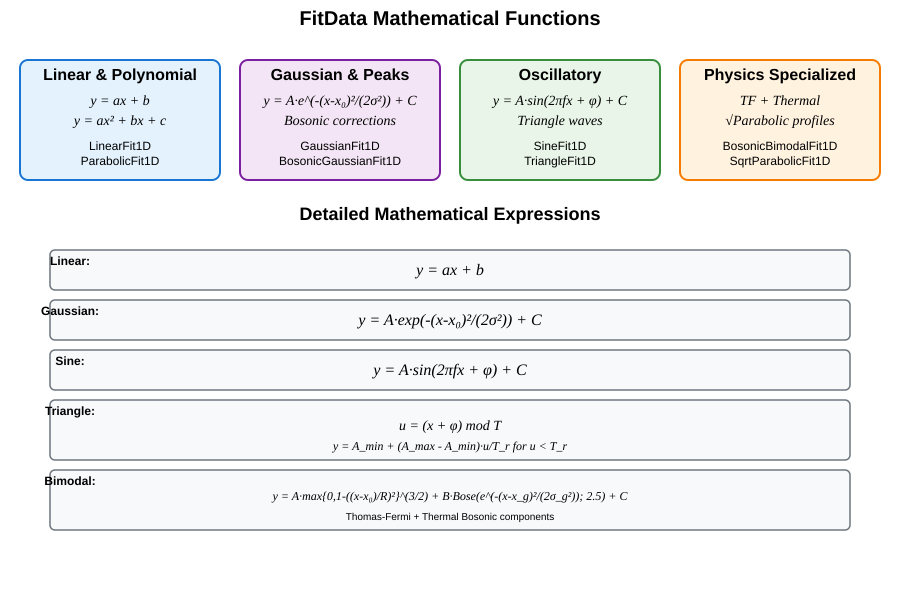

Fit Curves or Surfaces Using FitData
=====================================

The **FitData** framework provides a comprehensive object-oriented approach to fitting mathematical functions to experimental data in MATLAB. Built on top of MATLAB's Curve Fitting Toolbox, it offers automatic parameter estimation, customizable bounds, and robust optimization settings for a wide variety of common fitting scenarios in atomic, molecular, and optical (AMO) physics.

Overview
--------

The :class:`FitData` system follows a hierarchical design pattern where abstract base classes define the common interface and concrete implementations handle specific mathematical functions. The framework supports:

- **Automatic parameter estimation** from data characteristics
- **Customizable fit bounds** and starting points  
- **Robust optimization settings** with configurable tolerances
- **Built-in plotting capabilities** for visualization
- **Extensible architecture** for adding new fit functions

The class hierarchy is shown in the following diagram:

Basic Usage Workflow
--------------------

The typical workflow for using FitData follows these steps:

Core Classes
------------

FitData (Abstract Base)
^^^^^^^^^^^^^^^^^^^^^^^

The :class:`FitData` abstract base class provides the foundation for all fitting operations. It handles:

- **Data validation** and preprocessing
- **Parameter management** with automatic guessing and override capabilities
- **Optimization settings** (tolerance, maximum iterations, function evaluations)
- **Result storage** and access methods

**Key Properties:**

- :attr:`RawData`: Input experimental data
- :attr:`IsOverride`: Flag to enable parameter overrides
- :attr:`StartPointOverride`, :attr:`LowerOverride`, :attr:`UpperOverride`: Custom parameter bounds
- :attr:`Coefficient`: Fitted coefficients after :meth:`do()` is called
- :attr:`Result`: MATLAB fitobject containing full fit results
- :attr:`Gof`: Goodness of fit statistics

FitData1D (Abstract Base)
^^^^^^^^^^^^^^^^^^^^^^^^^

The :class:`FitData1D` class extends :class:`FitData` for one-dimensional curve fitting. It adds:

- **Standardized data format** validation (n×2 matrix of [x,y] coordinates)
- **Plotting capabilities** with automatic curve generation
- **Fit evaluation** at arbitrary x-coordinates via :meth:`evaluateFit`

**Key Methods:**

- :meth:`plot()`: Visualize raw data and fitted curve
- :meth:`evaluateFit(x)`: Evaluate fitted function at specified x values
- :meth:`do()`: Execute the fitting procedure

Available Fit Types
-------------------

The FitData framework provides implementations for a wide variety of mathematical functions commonly encountered in experimental physics:

Linear and Polynomial Fits
^^^^^^^^^^^^^^^^^^^^^^^^^^^

**LinearFit1D**

Fits linear functions of the form :math:`y = ax + b`.

.. code-block:: matlab

   % Example: Linear fit to noisy data
   x = linspace(0, 10, 50);
   y = 2*x + 1 + 0.1*randn(size(x));
   data = [x', y'];
   
   linearFit = LinearFit1D(data);
   linearFit.do();
   linearFit.plot();
   
   % Access results
   slope = linearFit.Coefficient(1);      % coefficient 'a'
   intercept = linearFit.Coefficient(2);  % coefficient 'b'

**ParabolicFit1D**

Fits parabolic functions of the form :math:`y = ax^2 + bx + c`.

.. code-block:: matlab

   % Example: Parabolic fit
   x = linspace(-5, 5, 100);
   y = 0.5*x.^2 + 2*x + 1 + 0.1*randn(size(x));
   data = [x', y'];
   
   parabolicFit = ParabolicFit1D(data);
   parabolicFit.do();
   parabolicFit.plot();

Gaussian and Peak Fits
^^^^^^^^^^^^^^^^^^^^^^

**GaussianFit1D**

Fits Gaussian functions of the form :math:`y = A e^{-(x-x_0)^2/(2\sigma^2)} + C`.

**Coefficients:**
- :math:`A`: amplitude
- :math:`x_0`: center position  
- :math:`\sigma`: width parameter
- :math:`C`: baseline offset

.. code-block:: matlab

   % Example: Gaussian fit to experimental peak
   x = linspace(-5, 5, 200);
   y = 2*exp(-(x-1).^2/0.5) + 0.1 + 0.05*randn(size(x));
   data = [x', y'];
   
   gaussianFit = GaussianFit1D(data);
   gaussianFit.do();
   gaussianFit.plot();
   
   % Extract physical parameters
   amplitude = gaussianFit.Coefficient(1);
   center = gaussianFit.Coefficient(2);  
   sigma = gaussianFit.Coefficient(3);
   offset = gaussianFit.Coefficient(4);
   
   % Calculate FWHM
   fwhm = 2*sqrt(2*log(2))*sigma;

Oscillatory Fits
^^^^^^^^^^^^^^^^^

**SineFit1D**

Fits sinusoidal functions of the form :math:`y = A \sin(2\pi f x + \phi) + C`.

**Coefficients:**
- :math:`A`: amplitude
- :math:`f`: frequency
- :math:`\phi`: phase
- :math:`C`: offset

.. code-block:: matlab

   % Example: Sine wave fit with automatic frequency estimation
   x = linspace(0, 10, 200);
   y = 2*sin(2*pi*0.5*x + pi/4) + 1 + 0.1*randn(size(x));
   data = [x', y'];
   
   sineFit = SineFit1D(data);
   sineFit.do();
   sineFit.plot();
   
   % Access oscillation parameters
   amplitude = sineFit.Coefficient(1);
   frequency = sineFit.Coefficient(2);
   phase = sineFit.Coefficient(3);
   offset = sineFit.Coefficient(4);

**TriangleFit1D**

Fits triangle wave functions with customizable rise and fall times.

**Formula:**

:math:`u = (x + \phi) \bmod T`

:math:`y(u) = \begin{cases}
A_{\min} + (A_{\max} - A_{\min})\, \dfrac{u}{T_r}, & 0 \le u < T_r \\
A_{\max} - (A_{\max} - A_{\min})\, \dfrac{u - T_r}{T - T_r}, & T_r \le u < T
\end{cases}`

**Coefficients:**
- :math:`A_{\max}`, :math:`A_{\min}`: maximum and minimum amplitudes
- :math:`\phi`: phase offset
- :math:`T`: period
- :math:`T_r`: rise time

.. code-block:: matlab

   % Example: Triangle wave fit
   x = linspace(0, 20, 200);
   y = sawtooth(2*pi*0.2*x, 0.5) + 0.1*randn(size(x));
   data = [x', y'];
   
   triangleFit = TriangleFit1D(data);
   triangleFit.do();
   triangleFit.plot();

Specialized Physics Fits
^^^^^^^^^^^^^^^^^^^^^^^^

**BosonicBimodalFit1D**

Fits atomic density profiles with both Thomas-Fermi (condensate) and thermal (bosonic) components. This is particularly useful for analyzing Bose-Einstein condensate experiments.

**Formula:**

:math:`y = A\,\max\{0,1-((x-x_0)/R)^2\}^{3/2} + B\,\mathrm{Bose}(e^{-(x-x_g)^2/(2\sigma_g^2)};2.5) + C`

**Coefficients:**
- Thomas-Fermi: :math:`A` (amplitude), :math:`x_0` (center), :math:`R` (radius)
- Thermal: :math:`B` (amplitude), :math:`x_g` (center), :math:`\sigma_g` (width)
- :math:`C`: baseline offset

.. code-block:: matlab

   % Example: Bimodal fit for BEC analysis
   x = linspace(-5, 5, 201)';
   
   % Simulate TF + thermal components
   tf_component = 1.5 * max(0, 1 - ((x-0.2)/1.2).^2).^(3/2);
   thermal_component = 0.6 * boseFunctionApprox(exp(-(x+0.4).^2/(2*0.8^2)), 2.5);
   y = tf_component + thermal_component + 0.05;
   
   data = [x, y];
   fitObj = BosonicBimodalFit1D(data);
   fitObj.do();
   fitObj.plot();
   
   % Extract condensate and thermal parameters
   tf_amplitude = fitObj.Coefficient(1);
   tf_center = fitObj.Coefficient(2);
   tf_radius = fitObj.Coefficient(3);
   thermal_amplitude = fitObj.Coefficient(4);

**BosonicGaussianFit1D**

Fits thermal atomic distributions using bosonic statistics corrections.

**SqrtParabolicFit1D**

Fits square-root parabolic profiles, often used for Thomas-Fermi distributions in trapped atomic gases.

Advanced Usage
--------------

Parameter Override System
^^^^^^^^^^^^^^^^^^^^^^^^^

For challenging fits or when automatic parameter estimation fails, you can override the initial guesses and bounds:

.. code-block:: matlab

   % Example: Custom parameter override
   fitObj = GaussianFit1D(data);
   
   % Enable override mode
   fitObj.IsOverride = true;
   
   % Set custom starting points [amplitude, center, sigma, offset]
   fitObj.StartPointOverride = [2.0, 1.0, 0.5, 0.1];
   
   % Set custom bounds
   fitObj.LowerOverride = [0, -2, 0.1, 0];
   fitObj.UpperOverride = [5, 3, 2, 1];
   
   % Execute fit with custom parameters
   fitObj.do();
   fitObj.plot();

You can also use convenience methods:

.. code-block:: matlab

   % Set default overrides based on current automatic estimates
   fitObj.setDefaultOverride();
   
   % Clear all overrides and return to automatic mode
   fitObj.clearOverride();

Optimization Settings
^^^^^^^^^^^^^^^^^^^^

Fine-tune the optimization process for difficult fits:

.. code-block:: matlab

   fitObj = SineFit1D(data);
   
   % Adjust optimization tolerances
   fitObj.TolFun = 1e-12;        % Function tolerance
   fitObj.MaxFunEvals = 5000;    % Maximum function evaluations  
   fitObj.MaxIter = 3000;        % Maximum iterations
   
   fitObj.do();

Batch Processing
^^^^^^^^^^^^^^^

Process multiple datasets efficiently:

.. code-block:: matlab

   % Example: Fit multiple Gaussian peaks
   datasets = {data1, data2, data3, data4};  % Cell array of [x,y] data
   fits = cell(size(datasets));
   
   for i = 1:length(datasets)
       fits{i} = GaussianFit1D(datasets{i});
       fits{i}.do();
   end
   
   % Extract all amplitudes
   amplitudes = cellfun(@(fit) fit.Coefficient(1), fits);
   
   % Plot all fits
   figure;
   for i = 1:length(fits)
       subplot(2,2,i);
       fits{i}.plot(gca, true);
       title(sprintf('Dataset %d', i));
   end

Integration with Experimental Workflows
---------------------------------------

The FitData framework integrates seamlessly with the broader MuscleMuseum experimental ecosystem:

BEC Experiment Analysis
^^^^^^^^^^^^^^^^^^^^^^

In BEC experiments, density fitting is automatically handled by the :class:`DensityFit` class:

.. code-block:: matlab

   % Example integration with BecExp
   becExp = BecExp("MyExperiment", "ConfigName");
   becExp.run();  % Collect experimental data
   
   % Automatic density fitting
   densityFit = DensityFit(becExp);
   densityFit.FitMethod = "GaussianFit1D";  % or "BosonicGaussianFit1D"
   densityFit.buildFit(1:10);  % Fit runs 1-10
   
   % Access fit results for all runs
   xSizes = densityFit.getSigmaX();
   ySizes = densityFit.getSigmaY();

Custom Fit Development
---------------------

To create new fit types, inherit from :class:`FitData1D` and implement the required abstract methods:

.. code-block:: matlab

   classdef MyCustomFit1D < FitData1D
       methods
           function obj = MyCustomFit1D(rawData)
               obj@FitData1D(rawData);
           end
           
           function setFormula(obj)
               % Define your custom fit function
               obj.Func = fittype('A*exp(-x/tau) + C', ...
                   'independent', 'x', ...
                   'coefficients', {'A', 'tau', 'C'});
           end
           
           function guessCoefficient(obj)
               % Implement parameter estimation logic
               x = obj.RawData(:,1);
               y = obj.RawData(:,2);
               
               % Your estimation algorithm here
               A_guess = max(y) - min(y);
               tau_guess = (max(x) - min(x)) / 3;
               C_guess = min(y);
               
               obj.StartPoint = [A_guess, tau_guess, C_guess];
               obj.Lower = [0, 0, min(y)];
               obj.Upper = [2*A_guess, 2*tau_guess, max(y)];
           end
       end
   end

Best Practices
--------------

**Data Quality**
- Ensure sufficient data points (at least 3× the number of fit parameters)
- Remove obvious outliers before fitting
- Consider data preprocessing (smoothing, baseline correction) for noisy data

**Parameter Estimation**
- Start with automatic parameter estimation before using overrides
- Use physical intuition to set reasonable parameter bounds
- For oscillatory data, ensure sufficient sampling to resolve the frequency

**Fit Validation**
- Always examine residuals and goodness-of-fit statistics
- Use :math:`R^2`, RMSE, and visual inspection to assess fit quality
- Consider alternative fit functions if residuals show systematic patterns

**Performance**
- For batch processing, consider parallel execution with MATLAB's Parallel Computing Toolbox
- Cache fit objects when processing similar datasets repeatedly
- Use appropriate optimization tolerances (tighter for critical fits, looser for screening)

**Error Handling**
- Implement try-catch blocks for automated fitting pipelines
- Log failed fits for later manual inspection
- Consider fallback fit types for robust automated analysis

The FitData framework provides a powerful, extensible foundation for quantitative analysis in AMO physics experiments, combining ease of use with the flexibility needed for specialized applications.
