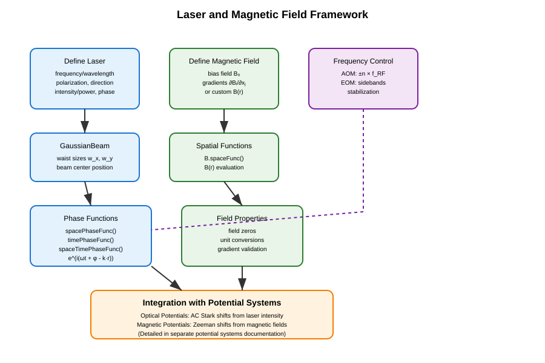
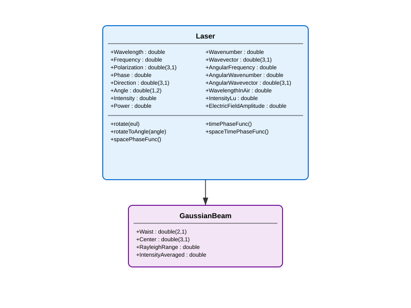
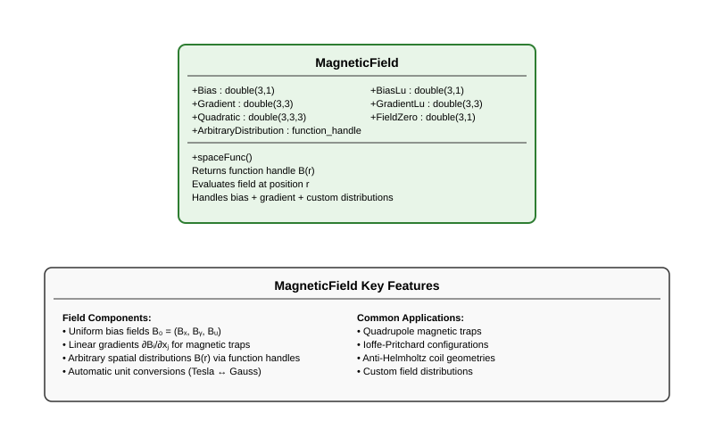

Lasers and Magnetic Fields
==========================

The **MuscleMuseum** framework provides comprehensive tools for modeling lasers and magnetic fields in atomic, molecular, and optical (AMO) physics experiments. These fundamental field classes serve as building blocks for more complex potential and trapping systems.

Overview
--------

The laser and magnetic field framework consists of several core components:

- **Laser systems**: Monochromatic laser beams with full polarization and spatial control
- **Gaussian beams**: Focused laser beams with spatial intensity profiles
- **Magnetic fields**: Static and spatially varying magnetic field configurations
- **Modulation**: Frequency control via acousto-optic and electro-optic modulators

These field classes can be combined with atomic properties to create various potential systems (covered in a separate documentation page).

The typical workflow for using these components is shown below:

Laser Systems
-------------

The laser framework provides precise control over all aspects of monochromatic laser beams, from basic parameters to advanced spatial and temporal phase functions.

Laser Class Hierarchy
^^^^^^^^^^^^^^^^^^^^^

Core Laser Class
^^^^^^^^^^^^^^^^

The :class:`Laser` class serves as the foundation for all optical field modeling. It encapsulates the essential properties of monochromatic light:

**Physical Parameters:**

- :attr:`Wavelength`/:attr:`Frequency`: Optical wavelength :math:`\lambda` [m] or frequency :math:`f` [Hz]
- :attr:`Polarization`: Jones polarization vector :math:`(E_x,E_y,E_z)`
- :attr:`Direction`/:attr:`Angle`: Propagation direction as Cartesian unit vector or spherical angles :math:`(\theta, \phi)`
- :attr:`Phase`: Optical phase :math:`\phi` [rad]
- :attr:`Intensity`/:attr:`Power`: Light intensity :math:`I` [W/m²] or total power :math:`P` [W]

**Derived Quantities:**

- :attr:`Wavevector`: :math:`\mathbf{k} = k \hat{\mathbf{k}}` [rad/m]
- :attr:`AngularFrequency`: :math:`\omega = 2\pi f` [rad/s]
- :attr:`ElectricFieldAmplitude`: :math:`|E| = \sqrt{2 Z_0 I}` [V/m]

**Basic Usage:**

.. code-block:: matlab

   % Create a laser with specific parameters
   laser = Laser(...
       frequency = 3.84e14, ...        % 780 nm (Rb D2 line)
       polarization = [1; 0; 0], ...   % Linear polarization along x
       direction = [0; 0; 1], ...      % Propagating along z
       intensity = 1e3, ...            % 1 kW/m²
       phase = 0 ...                   % Zero phase
   );
   
   % Access derived properties
   wavelength = laser.Wavelength;      % 780.24e-9 m
   k_vector = laser.AngularWavevector; % [0; 0; 8.04e6] rad/m
   omega = laser.AngularFrequency;     % 2.41e15 rad/s

**Advanced Features:**

The :class:`Laser` class provides sophisticated phase function generators for space-time dependent calculations:

.. code-block:: matlab

   % Generate phase functions
   spacePhase = laser.spacePhaseFunc();    % e^(i(φ - k·r))
   timePhase = laser.timePhaseFunc();      % e^(iωt)
   fullPhase = laser.spaceTimePhaseFunc(); % e^(i(ωt + φ - k·r))
   
   % Use in calculations
   position = [0; 0; 1e-6];  % 1 μm along z
   time = 1e-9;              % 1 ns
   
   spatial_factor = spacePhase(position);
   temporal_factor = timePhase(time);
   full_factor = fullPhase(position, time);

**Beam Manipulation:**

.. code-block:: matlab

   % Rotate laser direction and polarization
   euler_angles = [pi/4, pi/6, 0];  % ZYZ Euler angles
   laser.rotate(euler_angles);
   
   % Rotate to specific spherical angles
   target_angles = [pi/3, pi/4];    % [θ, φ]
   laser.rotateToAngle(target_angles);

Gaussian Beams
^^^^^^^^^^^^^^

The :class:`GaussianBeam` class extends :class:`Laser` to model focused :math:`\mathrm{TEM}_{00}` Gaussian laser beams, essential for optical trapping applications.

**Additional Properties:**

- :attr:`Waist`: :math:`1/e^2` beam radii :math:`(w_x, w_y)` [m]
- :attr:`Center`: Beam center position :math:`(x, y, z)` [m]
- :attr:`RayleighRange`: Rayleigh range :math:`z_R = \pi w_x w_y / \lambda` [m]
- :attr:`IntensityAveraged`: Average intensity :math:`I = P/(\pi w_x w_y)` [W/m²]

**Usage Example:**

.. code-block:: matlab

   % Create a focused Gaussian beam for optical trapping
   gaussianBeam = GaussianBeam(...
       waist = [50e-6; 60e-6], ...     % 50×60 μm waist
       center = [0; 0; 0], ...         % Centered at origin
       wavelength = 1064e-9, ...       % 1064 nm (Nd:YAG)
       power = 100e-3 ...              % 100 mW
   );
   
   % Calculate beam properties
   rayleigh_range = gaussianBeam.RayleighRange;  % ~8.8 mm
   peak_intensity = gaussianBeam.Intensity;      % Peak intensity
   avg_intensity = gaussianBeam.IntensityAveraged; % Average intensity

**Power-Intensity Relationship:**

For Gaussian beams, power and intensity are automatically linked:

.. code-block:: matlab

   % Setting power automatically calculates intensity
   beam.Power = 50e-3;  % 50 mW
   I_peak = beam.Intensity;  % Automatically calculated
   
   % Setting intensity automatically calculates power
   beam.Intensity = 1e6;  % 1 MW/m²
   P_total = beam.Power;  % Automatically calculated

Magnetic Fields
---------------

The magnetic field framework provides flexible modeling of static and spatially varying magnetic field configurations commonly used in atomic physics experiments.

Magnetic Field Class Structure
^^^^^^^^^^^^^^^^^^^^^^^^^^^^^^

MagneticField Class
^^^^^^^^^^^^^^^^^^^

The :class:`MagneticField` class models magnetic field distributions using polynomial expansions or arbitrary functions.

**Field Components:**

- :attr:`Bias`: Uniform bias field :math:`\mathbf{B}_0 = (B_x, B_y, B_z)` [T]
- :attr:`Gradient`: Linear gradient matrix :math:`\partial B_i/\partial x_j` [T/m]
- :attr:`Quadratic`: Quadratic terms (not yet implemented)
- :attr:`ArbitraryDistribution`: Custom spatial distribution :math:`\mathbf{B}(\mathbf{r})`

**Mathematical Representation:**

The magnetic field at position :math:`\mathbf{r}` is calculated as:

.. math::
   \mathbf{B}(\mathbf{r}) = \mathbf{B}_0 + \nabla \mathbf{B} \cdot \mathbf{r} + \text{quadratic terms}

**Basic Usage:**

.. code-block:: matlab

   % Uniform magnetic field
   uniform_field = MagneticField(bias = [0; 0; 1e-4]); % 1 G along z
   
   % Quadrupole magnetic trap
   grad_matrix = diag([10, 10, -20]) * 1e-2; % [T/m]
   quadrupole_trap = MagneticField(...
       bias = [0; 0; 5e-4], ...     % 5 G bias
       gradient = grad_matrix ...
   );
   
   % Custom field distribution
   custom_field = MagneticField(...
       distribution = @(r) [0; 0; 1e-4] .* exp(-sum(r.^2)/1e-6) ...
   );

**Unit Conversions:**

The framework provides convenient unit conversions between Tesla and Gauss:

.. code-block:: matlab

   field = MagneticField(bias = [0; 0; 1e-4]); % 1 G in Tesla
   
   % Access in different units
   bias_tesla = field.Bias;        % [0; 0; 1e-4] T
   bias_gauss = field.BiasLu;      % [0; 0; 1] G
   
   % Gradients
   grad_tesla_per_m = field.Gradient;    % [T/m]
   grad_gauss_per_cm = field.GradientLu; % [G/cm]

**Spatial Field Functions:**

.. code-block:: matlab

   % Generate spatial field function
   field_func = field.spaceFunc();
   
   % Evaluate at specific positions
   positions = [0, 1e-3, 2e-3; 0, 0, 0; 0, 0, 0]; % x positions
   B_values = field_func(positions);
   
   % Find field zero (for diagonal gradients)
   field_zero_pos = field.FieldZero; % Position where B = 0

**Common Magnetic Trap Configurations:**

.. code-block:: matlab

   % Ioffe-Pritchard trap
   ioffe_trap = MagneticField(...
       bias = [0; 0; 1e-4], ...           % Axial bias
       gradient = [20e-2, 0, 0; ...       % Radial gradients
                   0, 20e-2, 0; ...
                   0, 0, -2e-2] ...       % Weak axial gradient
   );
   
   % Anti-Helmholtz coil configuration
   anti_helmholtz = MagneticField(...
       gradient = diag([10, 10, -20]) * 1e-2 ... % [T/m]
   );

Integration with Potential Systems
^^^^^^^^^^^^^^^^^^^^^^^^^^^^^^^^^^

The :class:`MagneticField` class serves as the foundation for creating magnetic potentials that describe Zeeman energy shifts. When combined with atomic properties, magnetic fields can create trapping or anti-trapping potentials depending on the magnetic quantum numbers of the atomic state.

The conversion from magnetic fields to atomic potentials involves:

- **Low Field Regime (Linear Zeeman)**: Energy shifts proportional to :math:`|\mathbf{B}|`
- **High Field Regime (Paschen-Back)**: Decoupled nuclear and electronic contributions
- **Automatic regime selection**: Based on field strength vs. hyperfine splitting

These potential calculations are handled by specialized classes covered in the potential systems documentation.

Integration with Optical Potential Systems
-------------------------------------------

The :class:`Laser` and :class:`GaussianBeam` classes provide the electromagnetic field foundations for creating optical potentials. When combined with atomic polarizability data, these laser fields can create:

- **Optical lattices**: Periodic potentials from standing wave interference
- **Optical dipole traps**: Localized trapping from focused Gaussian beams  
- **Optical tweezers**: Highly focused beams for single atom manipulation

The interaction strength depends on:

- **Laser intensity**: Higher intensity creates deeper potentials
- **Detuning**: Red-detuned light creates attractive potentials, blue-detuned creates repulsive
- **Atomic polarizability**: Species and state-dependent coupling strength
- **Beam geometry**: Waist size and shape determine spatial extent

These optical potential calculations and applications are covered in detail in the potential systems documentation.

Laser Frequency Control
-----------------------

Precise frequency control is achieved using acousto-optic modulators (AOMs) and electro-optic modulators (EOMs).

Acousto-Optic Modulators (AOM)
^^^^^^^^^^^^^^^^^^^^^^^^^^^^^^^

AOMs provide frequency shifts through acoustic wave interactions:

.. code-block:: matlab

   % Create AOM with 80 MHz drive frequency
   aom = Aom(80); % MHz
   
   % Single-pass configuration
   shift_sp_plus1 = aom.shiftSP(+1);  % +80 MHz
   shift_sp_minus1 = aom.shiftSP(-1); % -80 MHz
   
   % Double-pass configuration (retro-reflected)
   shift_dp_plus1 = aom.shiftDP(+1);  % +160 MHz
   shift_dp_minus1 = aom.shiftDP(-1); % -160 MHz

**Typical Applications:**

.. code-block:: matlab

   % Laser cooling setup
   cooling_aom = Aom(200);  % 200 MHz AOM
   red_detuned = cooling_aom.shiftSP(-1); % -200 MHz (red detuning)
   
   % Optical pumping
   pumping_aom = Aom(78.5);  % Specific frequency for state selection
   pump_shift = pumping_aom.shiftDP(+1); % +157 MHz

Electro-Optic Modulators (EOM)
^^^^^^^^^^^^^^^^^^^^^^^^^^^^^^^

EOMs generate sidebands for phase modulation and frequency stabilization:

.. code-block:: matlab

   % Create EOM with 40 MHz modulation
   eom = Eom(40); % MHz
   
   % Generate sidebands
   first_order_red = eom.shift(-1);   % -40 MHz
   carrier = eom.shift(0);            % 0 MHz (carrier)
   first_order_blue = eom.shift(+1);  % +40 MHz

**Frequency Stabilization:**

.. code-block:: matlab

   % PDH (Pound-Drever-Hall) stabilization
   pdh_eom = Eom(25); % 25 MHz modulation
   
   % Generate error signal from sideband interference
   red_sideband = pdh_eom.shift(-1);
   blue_sideband = pdh_eom.shift(+1);

Advanced Field Applications
---------------------------

Multi-Beam Laser Systems
^^^^^^^^^^^^^^^^^^^^^^^^^

Creating complex laser configurations with multiple beams:

.. code-block:: matlab

   % Create array of laser beams for lattice formation
   beam1 = Laser(wavelength=1064e-9, intensity=1e6, direction=[1;0;0]);
   beam2 = Laser(wavelength=1064e-9, intensity=1e6, direction=[-1;0;0]);
   beam3 = Laser(wavelength=1064e-9, intensity=1e6, direction=[0;1;0]);
   
   % Counter-propagating beams for 1D lattice
   lattice_beams = [beam1, beam2];
   
   % Calculate interference pattern (simplified)
   for i = 1:length(lattice_beams)
       phase_func = lattice_beams(i).spacePhaseFunc();
       % Use phase functions to calculate standing wave patterns
   end

Complex Magnetic Field Configurations
^^^^^^^^^^^^^^^^^^^^^^^^^^^^^^^^^^^^^

Designing sophisticated magnetic trap geometries:

.. code-block:: matlab

   % Ioffe-Pritchard trap with custom curvature
   custom_field = MagneticField(...
       distribution = @(r) ioffe_pritchard_field(r) ...
   );
   
   function B = ioffe_pritchard_field(r)
       % Custom implementation of Ioffe-Pritchard field
       x = r(1,:); y = r(2,:); z = r(3,:);
       
       % Bias field along z
       B0 = 1e-4; % 1 G
       
       % Radial gradients
       grad_radial = 20e-2; % 20 G/cm
       
       % Axial curvature
       curvature = 1e-2; % G/cm²
       
       Bx = grad_radial * x;
       By = grad_radial * y;
       Bz = B0 + curvature * (x.^2 + y.^2 - 2*z.^2);
       
       B = [Bx; By; Bz];
   end

Time-Varying Fields
^^^^^^^^^^^^^^^^^^^

Implementing dynamic field control:

.. code-block:: matlab

   % Time-dependent magnetic field for evaporative cooling
   function create_evap_sequence()
       initial_field = MagneticField(bias=[0;0;2e-4]); % 2 G
       
       % Create time-dependent field function
       evap_field = @(t) time_dependent_field(t, initial_field);
       
       % Use in experimental sequence
       times = linspace(0, 10, 100); % 10 second evaporation
       for i = 1:length(times)
           current_field = evap_field(times(i));
           % Apply field at this time step
       end
   end
   
   function field = time_dependent_field(t, initial_field)
       % Exponential decay for evaporative cooling
       decay_rate = 0.1; % 1/s
       scale_factor = exp(-decay_rate * t);
       
       field = MagneticField(bias = initial_field.Bias * scale_factor);
   end

Best Practices
--------------

**Parameter Consistency**
- Always specify either wavelength OR frequency, not both
- Use consistent unit systems throughout calculations  
- Validate field gradients for physical realizability
- Check that laser powers and magnetic field strengths are experimentally reasonable

**Numerical Considerations**
- Cache expensive phase function calculations when used repeatedly
- Use vectorized operations for spatial field evaluations
- Consider computational cost vs. accuracy trade-offs for complex field distributions

**Physical Validation**
- Verify magnetic field configurations are experimentally achievable
- Check that optical powers are within safe operating limits
- Validate that field gradients don't exceed hardware capabilities

**Error Handling**
- Implement bounds checking for physical parameters
- Handle edge cases (e.g., zero magnetic fields, undefined directions)
- Validate input parameters before expensive calculations

**Performance Optimization**
- Pre-calculate commonly used phase functions and field distributions
- Use appropriate spatial sampling for field evaluations
- Consider parallel computation for parameter sweeps and multi-beam systems

The laser and magnetic field framework provides the fundamental electromagnetic field modeling capabilities needed for AMO physics experiments. These classes serve as building blocks that can be combined with atomic properties to create sophisticated trapping and manipulation systems.
