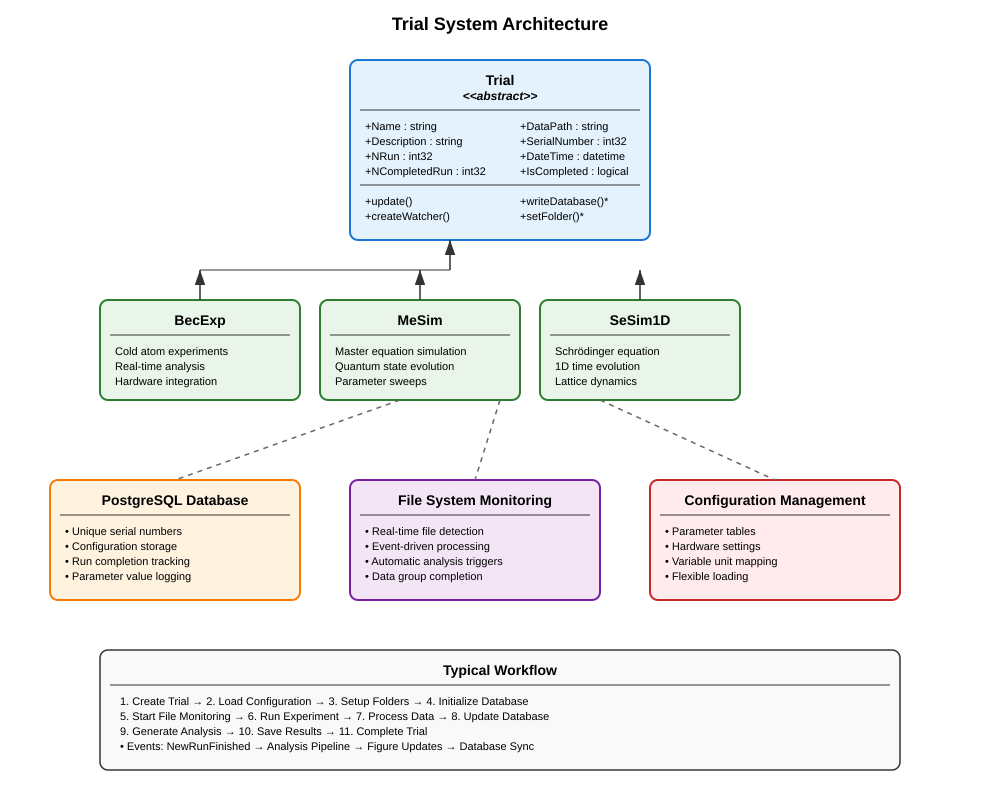

Manage Experimental and Simulation Trials
=========================================

The **Trial** framework provides a comprehensive system for orchestrating and managing experimental runs and simulations in the MuscleMuseum environment. It handles data organization, database persistence, file system monitoring, and experimental lifecycle management with robust error handling and automatic data processing.

Overview
--------

The Trial system serves as the backbone for experimental data management, providing:

- **Lifecycle management**: Complete experimental workflow from setup to completion
- **Database integration**: PostgreSQL-based persistence and querying
- **File system monitoring**: Automatic detection of new data files
- **Configuration management**: Flexible parameter and hardware settings
- **Data organization**: Hierarchical folder structure with date-based organization
- **Event-driven processing**: Real-time analysis triggered by data arrival
- **Multi-dimensional scanning**: Support for 1D and 2D parameter sweeps

The framework follows an object-oriented design where the abstract :class:`Trial` base class defines the common interface, and concrete implementations (like :class:`BecExp`) handle experiment-specific functionality.

Trial Architecture
------------------

Core Trial Class
----------------

The :class:`Trial` abstract base class provides the fundamental infrastructure for all experimental and simulation workflows.

**Essential Properties:**

- :attr:`Name`: Trial identifier matching configuration entries
- :attr:`Description`: Human-readable description of the experimental purpose
- :attr:`NRun`: Total number of planned experimental runs
- :attr:`NCompletedRun`: Number of successfully completed runs
- :attr:`DateTime`: Timestamp when the trial was initiated
- :attr:`SerialNumber`: Unique database-generated identifier

**Data Management:**

- :attr:`DataPath`: Full path to trial data storage directory
- :attr:`ObjectPath`: Path to saved trial object file
- :attr:`DataFormat`: File extension for data files (e.g., ".tif", ".mat")
- :attr:`DataPrefix`: Filename prefix for run data (e.g., "run_1_atom.tif")

**Abstract Interface:**

Subclasses must implement these essential methods:

- :meth:`writeDatabase()`: Create initial database entry
- :meth:`updateDatabase()`: Synchronize current state to database
- :meth:`setFolder()`: Configure data storage directories
- :meth:`setConfigProperty()`: Apply configuration parameters

**Basic Usage Pattern:**

.. code-block:: matlab

   % Create a concrete trial implementation
   trial = ConcreteTrial("ExperimentName", "ConfigurationName");
   
   % The trial automatically:
   % 1. Loads configuration from database/file
   % 2. Creates date-organized folder structure
   % 3. Establishes database connection and logging
   % 4. Assigns unique serial number
   % 5. Initializes file system monitoring
   
   % Update trial state and persist changes
   trial.update();

Data Organization System
------------------------

**Hierarchical Folder Structure:**

The Trial system creates a standardized folder hierarchy:

.. code-block:: text

   ParentPath/
   ├── YYYY/                    % Year folder
   │   ├── YYYY.MM/            % Year.Month folder  
   │   │   ├── MM.DD/          % Month.Day folder
   │   │   │   ├── TrialName_001/     % Trial folder with index
   │   │   │   │   ├── data/          % Raw experimental data
   │   │   │   │   ├── analysis/      % Processed analysis results
   │   │   │   │   ├── logs/          % Cicero and hardware logs
   │   │   │   │   ├── object.mat     % Saved trial object
   │   │   │   │   └── description.txt % Human-readable description

**Automatic File Naming:**

.. code-block:: matlab

   % Files are automatically named with consistent patterns:
   % run_1_atom.tif, run_1_probe.tif, run_1_bg.tif
   % run_2_atom.tif, run_2_probe.tif, run_2_bg.tif
   % ...

Database Integration
--------------------

**PostgreSQL Backend:**

The Trial system uses PostgreSQL for robust data persistence:

.. code-block:: matlab

   % Database connections are automatically managed
   trial = ConcreteTrial("MyExperiment", "MyConfig");
   
   % Writer connection for data insertion
   trial.Writer  % database.postgre.connection object
   
   % Reader connection for data queries  
   trial.Reader  % database.postgre.connection object

**Automatic Schema Management:**

Each trial type gets its own database table with:

- Unique serial number generation
- Timestamp tracking
- Configuration parameter storage
- Run completion status
- Scanned variable values

**Data Persistence:**

.. code-block:: matlab

   % Manual object persistence
   trial.updateObject();     % Save to .mat file
   trial.updateDatabase();   % Update database record
   trial.update();          % Both operations together

File System Monitoring
----------------------

**Real-Time Data Detection:**

The Trial system monitors data directories for new files:

.. code-block:: matlab

   % File system watcher automatically created
   trial.createWatcher();
   
   % Watcher triggers events when DataGroupSize files are detected
   % For example, if DataGroupSize = 3:
   % - run_1_atom.tif
   % - run_1_probe.tif  
   % - run_1_bg.tif
   % → Triggers NewRunFinished event

**Event-Driven Processing:**

.. code-block:: matlab

   % Listen for new run completion
   listener = addlistener(trial, 'NewRunFinished', @(src,evt) processNewRun(src,evt));
   
   function processNewRun(trial, eventData)
       % Automatically triggered when new data arrives
       runIndex = trial.NCompletedRun + 1;
       
       % Process the new data
       trial.processRun(runIndex);
       
       % Update completion count
       trial.NCompletedRun = runIndex;
       trial.update();
   end

Parameter Scanning
------------------

**1D Parameter Scans:**

.. code-block:: matlab

   % Configure single parameter scan
   trial.ScannedVariable = "MagneticField";
   trial.ScannedVariableUnit = "G";
   trial.NRun = 21;  % 21 different field values
   
   % Scanned values are automatically tracked per run
   scannedValues = trial.ScannedVariableList;  % 1×21 array

**2D Parameter Scans:**

.. code-block:: matlab

   % Configure two-parameter scan
   trial.ScannedVariable = "MagneticField";
   trial.ScannedVariable2 = "HoldTime";
   trial.ScannedVariableUnit = "G";
   trial.ScannedVariableUnit2 = "ms";
   trial.Is2dScan = true;
   trial.NRun = 100;  % 10×10 parameter grid
   
   % Access 2D scan data
   [X, Y] = trial.VariableGrid;  % Meshgrid for plotting
   sortedRuns = trial.RunListSorted;  % Runs sorted by parameter values

Configuration System
--------------------

**Flexible Configuration Loading:**

.. code-block:: matlab

   % Load from database configuration
   trial = ConcreteTrial("ExperimentName", "DatabaseConfigName");
   
   % Load from table
   configTable = readtable("experiment_config.xlsx");
   trial = ConcreteTrial("ExperimentName", configTable);
   
   % Load from struct
   configStruct.param1 = value1;
   configStruct.param2 = value2;
   trial = ConcreteTrial("ExperimentName", configStruct);

**Dynamic Properties:**

The Trial class supports dynamic property addition for experiment-specific parameters:

.. code-block:: matlab

   % Add custom properties at runtime
   addprop(trial, 'CustomParameter');
   trial.CustomParameter = customValue;
   
   % Properties are automatically included in database updates

Advanced Features
-----------------

**GUI Integration:**

.. code-block:: matlab

   % Associate with control panel GUI
   trial.ControlAppName = "ExperimentControlPanel";
   
   % Log messages are automatically routed to GUI
   trial.displayLog("Experiment started", "normal");
   trial.displayLog("Warning: Low laser power", "warning");
   trial.displayLog("Error: Camera disconnected", "error");

**Automatic Cleanup:**

.. code-block:: matlab

   % Configure automatic deletion of empty trials
   trial.IsAutoDelete = true;
   
   % Trials with NCompletedRun = 0 are automatically removed

**Serialization and Loading:**

.. code-block:: matlab

   % Save trial object
   save(trial.ObjectPath, 'trial');
   
   % Load existing trial
   loadedTrial = loadTrial("ExperimentName", serialNumber);
   
   % Delete completed trial
   deleteTrial("ExperimentName", serialNumber);

Error Handling and Recovery
---------------------------

**Robust Database Operations:**

.. code-block:: matlab

   try
       trial.writeDatabase();
   catch ME
       trial.displayLog("Database write failed: " + ME.message, "error");
       % Implement fallback to local storage
   end

**File System Resilience:**

.. code-block:: matlab

   % Handle missing data files gracefully
   if exist(trial.DataPath, 'dir')
       trial.createWatcher();
   else
       trial.displayLog("Data directory not found, creating...", "warning");
       mkdir(trial.DataPath);
   end

**Connection Recovery:**

.. code-block:: matlab

   % Automatic database reconnection on load
   function obj = loadobj(obj)
       try
           obj.Writer = createWriter(obj.DatabaseName);
           obj.Reader = createReader(obj.DatabaseName);
       catch
           warning('Database connection failed, operating in offline mode');
       end
   end

Best Practices
--------------

**Trial Design:**
- Use descriptive trial names that clearly indicate the experimental purpose
- Configure appropriate :attr:`DataGroupSize` for your acquisition pattern
- Set realistic :attr:`NRun` estimates to avoid database bloat

**Data Management:**
- Regularly clean up completed trials to manage disk space
- Use the automatic date-based organization for long-term storage
- Implement proper error handling for database operations

**Performance:**
- Minimize database writes during acquisition
- Use batch updates when possible
- Configure file watchers appropriately for your data rate

**Configuration:**
- Store all experimental parameters in configuration tables
- Use version control for configuration files
- Document configuration changes for reproducibility

**Monitoring:**
- Implement proper logging for debugging and audit trails
- Use the event system for real-time monitoring
- Set up appropriate error notifications

The Trial framework provides a robust foundation for experimental data management, ensuring reproducible, well-organized experiments with comprehensive logging and analysis capabilities. Its extensible design allows for easy adaptation to new experimental requirements while maintaining consistency across different types of measurements.
