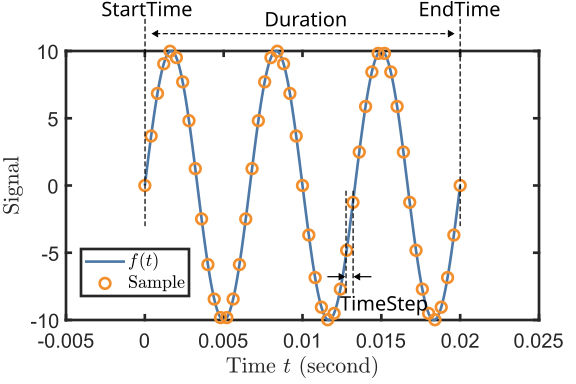

Waveform and WaveformList
======================================

Waveform
--------------------------------------

The :class:`Waveform` class handles the software generations of waveforms. We define a waveform as a function of time:

.. math::
    \mathrm{Waveform} = f(t),

where :math:`t` represents time. For every concrete subclass of :class:`Waveform`, a
:meth:`TimeFunc` method is provided, which determines the waveform. The output of :meth:`TimeFunc`
is a `function handle <https://www.mathworks.com/help/matlab/function-handles.html>`_ representing
:math:`f(t)`, which takes a one-dimensional array :math:`t` as the input. Once the :meth:`TimeFunc`
method is provided, the samples of the waveform are calculated every time the :attr:`Sample`
property is called. The waveforms defined by the :class:`Waveform` class are all finite with
definite :attr:`StartTime` and :attr:`Duration`. Meanwhile, A :attr:`SamplingRate` must be given by
users or client apps, from which a dependent property  :attr:`TimeStep` is calculated as
:math:`\mathrm{TimeStep} = 1/\mathrm{SamplingRate}`. The figure below demonstrates their
relationship with :attr:`Sample` and waveform function :math:`f(t)`.

We note that :class:`Waveform` itself is an abstract class. Therefore, it must be inherited by a concrete subclass then be 
constructed.  In the following, we give an example of constructing a :class:`SineWave` (as a subclass of :class:`Waveform`)
object:

.. code-block:: matlab 

    sw = SineWave(...
       amplitude = 20,...
       duration = 1000e-3,...
       startTime = 0e-3,...
       frequency = 100); %Set parameters
    sw.Frequency = 150; %Change parameters after construction
    sw.SamplingRate = 1e4; %Change sampling rate

The function handle of the waveform can be obtained by calling the method :meth:`TimeFunc`. Using the function handle, we can build 
the waveform samples:

.. code-block:: matlab 

    swf = sw.TimeFunc; %Extract the function handle
    t = sw.StartTime : sw.TimeStep : sw.EndTime; %Define the time array
    sample = swf(t); %call the function to calculate the samples
    plot(t,sample) %plot the waveform

Alternatively, we can use the built-in dependent property :attr:`Sample` and the :meth:`plot` method:

.. code-block:: matlab 

    sample = sw.Sample; %call the dependent property to calculate the samples
    sw.plot %plot the waveform using the plot method

In order to handle different types of waveforms, we include a few abstract subclasses of :class:`Waveform`, namely 
:class:`PeriodicWaveform`, :class:`PartialPeriodicWaveform`, :class:`ModulatedWaveform`, and :class:`RandomWaveform`. 
Their inheritance relationship is shown in the following class diagram:

PeriodicWaveform
^^^^^^^^^^^^^^^^^^^^^^^^^^^^^^^^^

The :class:`PeriodicWaveform` abstract class extends :class:`Waveform` to provide specialized functionality for waveforms that repeat with a defined frequency and period. This class serves as the foundation for common periodic signals like sine waves, square waves, and other repeating patterns.

**Key Properties:**

- :attr:`Amplitude`: Peak-to-peak amplitude, typically in Volts
- :attr:`Offset`: DC offset value
- :attr:`Frequency`: Repetition frequency :math:`f` in Hz
- :attr:`Phase`: Phase offset :math:`\phi` in radians
- :attr:`Period`: Time period :math:`T = 1/f` of one complete cycle
- :attr:`NPeriod`: Number of complete periods in the waveform duration
- :attr:`NRepeat`: Number of times the cycle segment repeats

**Concrete Implementations:**

SineWave
""""""""

Generates sinusoidal waveforms with the mathematical form:

.. math::
   f(t) = \mathbb{1}_{[t_0,t_0+T]}(t) \cdot \left(\frac{A}{2} \sin(2\pi f (t-t_0) + \phi) + \text{offset}\right)

.. code-block:: matlab

   % Basic sine wave
   sine = SineWave(frequency = 1000, amplitude = 2.0, duration = 0.01);
   sine.SamplingRate = 10000;
   sine.plot();
   
   % Sine wave with phase offset
   sinePhase = SineWave(frequency = 500, amplitude = 1.0, phase = pi/4, duration = 0.02);
   sinePhase.plot();

SquareWave
""""""""""

Generates square wave signals with configurable duty cycle:

.. code-block:: matlab

   % Standard 50% duty cycle square wave
   square = SquareWave(frequency = 1000, amplitude = 3.0, duration = 0.01);
   square.plot();
   
   % 25% duty cycle square wave for PWM applications
   pwm = SquareWave(frequency = 500, amplitude = 5.0, dutyCycle = 0.25, duration = 0.02);
   pwm.plot();

ConstantWave
""""""""""""

Creates constant (DC) waveforms:

.. code-block:: matlab

   % Simple constant voltage
   constant = ConstantWave(amplitude = 2.5, duration = 0.01);
   constant.plot();
   
   % Constant with offset
   constOffset = ConstantWave(amplitude = 1.0, offset = 3.0, duration = 0.005);
   constOffset.plot();

**Cycle-Based Optimization:**

Periodic waveforms support hardware-optimized generation using cycle repetition:

.. code-block:: matlab

   sine = SineWave(frequency = 1000, amplitude = 1.0, duration = 1.0);
   sine.NPeriodPerCycle = 5;  % Use 5 periods per hardware cycle
   
   % Access cycle-based properties
   oneCycle = sine.SampleOneCycle;    % Samples for one cycle segment
   nRepeats = sine.NRepeat;           % Number of times to repeat the cycle
   cycleDuration = sine.DurationOneCycle;  % Duration of one cycle segment

PartialPeriodicWaveform
^^^^^^^^^^^^^^^^^^^^^^^^^^^^^^^^^

The :class:`PartialPeriodicWaveform` abstract class extends :class:`Waveform` to handle waveforms that have periodic behavior during part of their duration, with additional non-periodic segments before and/or after the periodic section. This is particularly useful for ramps, pulses, and complex control sequences.

**Key Features:**

- **Before segment**: Non-periodic waveform before the periodic section
- **Periodic segment**: Repeating waveform with defined cycles
- **After segment**: Non-periodic waveform after the periodic section
- **Flexible transitions**: Smooth connections between segments

**Common Implementations:**

LinearRamp
""""""""""

Creates linear transitions between values:

.. code-block:: matlab

   % Basic linear ramp from 0 to 5V over 10ms
   ramp = LinearRamp(startValue = 0, stopValue = 5, rampTime = 0.01);
   ramp.SamplingRate = 10000;
   ramp.plot();
   
   % Negative ramp with longer duration
   downRamp = LinearRamp(startValue = 10, stopValue = 2, rampTime = 0.02, duration = 0.05);
   downRamp.plot();

TrapezoidalPulse
""""""""""""""""

Generates trapezoidal pulses with configurable rise, hold, and fall times:

.. code-block:: matlab

   % Trapezoidal pulse with 2ms rise, 5ms hold, 1ms fall
   trapPulse = TrapezoidalPulse(amplitude = 3.0, riseTime = 0.002, ...
                                holdTime = 0.005, fallTime = 0.001);
   trapPulse.plot();

Smooth Transitions
""""""""""""""""""

For applications requiring smooth derivatives, several smooth transition classes are available:

.. code-block:: matlab

   % Hyperbolic tangent pulse for smooth edges
   tanhPulse = TanhPulse(amplitude = 2.0, riseTime = 0.001, ...
                         holdTime = 0.01, fallTime = 0.001);
   tanhPulse.plot();
   
   % PCHIP (Piecewise Cubic Hermite) interpolated pulse
   pchipPulse = PchipPulse(amplitude = 1.5, riseTime = 0.002, ...
                           holdTime = 0.008, fallTime = 0.002);
   pchipPulse.plot();

**Segment Access:**

.. code-block:: matlab

   trapPulse = TrapezoidalPulse(amplitude = 2.0, riseTime = 0.001, ...
                                holdTime = 0.005, fallTime = 0.001);
   
   % Access individual segments
   beforeSamples = trapPulse.SampleBefore;    % Rise portion
   cycleSamples = trapPulse.SampleOneCycle;   % Hold portion (periodic)
   afterSamples = trapPulse.SampleAfter;      % Fall portion

ModulatedWaveform
^^^^^^^^^^^^^^^^^^^^^^^^^^^^^^^^^

The :class:`ModulatedWaveform` abstract class extends :class:`Waveform` to provide advanced signal modulation capabilities. This class enables amplitude modulation (AM), frequency modulation (FM), and phase modulation (PM) using other waveforms as modulation sources.

**Key Properties:**

- :attr:`AmplitudeModulation`: Waveform for amplitude modulation
- :attr:`FrequencyModulation`: Waveform for frequency modulation  
- :attr:`PhaseModulation`: Waveform for phase modulation
- **Carrier parameters**: Base frequency, amplitude, and phase

**Concrete Implementations:**

SineWaveModulated
"""""""""""""""""

Creates modulated sine waves with flexible modulation schemes:

.. code-block:: matlab

   % Amplitude modulation example
   carrier = SineWave(frequency = 1000, amplitude = 2.0, duration = 0.1);
   modulator = SineWave(frequency = 50, amplitude = 0.5, duration = 0.1);
   
   amWave = SineWaveModulated(frequency = 1000, amplitude = 2.0, duration = 0.1);
   amWave.AmplitudeModulation = WaveformList("AM_mod", waveformOrigin = {modulator});
   amWave.plot();

**Frequency Modulation:**

.. code-block:: matlab

   % Frequency modulation for frequency sweeps
   fmModulator = LinearRamp(startValue = -100, stopValue = 100, rampTime = 0.05);
   
   fmWave = SineWaveModulated(frequency = 1000, amplitude = 1.0, duration = 0.05);
   fmWave.FrequencyModulation = WaveformList("FM_mod", waveformOrigin = {fmModulator});
   fmWave.plot();

**Combined Modulation:**

.. code-block:: matlab

   % Simultaneous AM and FM
   ampMod = SineWave(frequency = 10, amplitude = 0.3, duration = 0.2);
   freqMod = SineWave(frequency = 5, amplitude = 50, duration = 0.2);
   
   complexWave = SineWaveModulated(frequency = 1000, amplitude = 1.0, duration = 0.2);
   complexWave.AmplitudeModulation = WaveformList("AM", waveformOrigin = {ampMod});
   complexWave.FrequencyModulation = WaveformList("FM", waveformOrigin = {freqMod});
   complexWave.plot();

**Applications:**

- **Chirped signals**: For radar and sonar applications
- **Communication signals**: AM/FM radio simulation
- **Control system testing**: Variable frequency drive simulation
- **Spectroscopy**: Frequency-modulated spectroscopy signals

RandomWaveform
^^^^^^^^^^^^^^^^^^^^^^^^^^^^^^^^^

The :class:`RandomWaveform` abstract class extends :class:`Waveform` to provide random and pseudo-random signal generation capabilities. This is useful for noise generation, system testing, and stochastic signal simulation.

**Concrete Implementations:**

UniformRandom
"""""""""""""

Generates uniformly distributed random values:

.. code-block:: matlab

   % Uniform random noise between -1 and +1
   uniformNoise = UniformRandom(amplitude = 2.0, duration = 0.01);
   uniformNoise.SamplingRate = 10000;
   uniformNoise.plot();
   
   % Offset uniform random signal
   offsetUniform = UniformRandom(amplitude = 1.0, offset = 2.5, duration = 0.02);
   offsetUniform.plot();

GaussianRandom
""""""""""""""

Generates normally distributed random values:

.. code-block:: matlab

   % Gaussian white noise
   gaussianNoise = GaussianRandom(amplitude = 1.0, duration = 0.01);
   gaussianNoise.SamplingRate = 20000;
   gaussianNoise.plot();
   
   % Gaussian noise with DC offset
   gaussianOffset = GaussianRandom(amplitude = 0.5, offset = 1.0, duration = 0.05);
   gaussianOffset.plot();

**Applications:**

- **System testing**: Adding noise to test signal processing algorithms
- **Channel simulation**: Modeling communication channel noise
- **Monte Carlo methods**: Random input generation for simulations
- **Dithering**: Improving ADC/DAC performance with controlled noise

**Random Seed Control:**

.. code-block:: matlab

   % Reproducible random sequences
   rng(12345);  % Set random seed
   noise1 = UniformRandom(amplitude = 1.0, duration = 0.01);
   
   rng(12345);  % Reset to same seed
   noise2 = UniformRandom(amplitude = 1.0, duration = 0.01);
   % noise1 and noise2 will be identical

WaveformList
--------------------------------------

The :class:`WaveformList` class manages collections of waveforms to create complex sequences and combinations. It supports two primary modes of operation: sequential concatenation and simultaneous superposition of multiple waveforms.

**Key Properties:**

- :attr:`ConcatMethod`: "Sequential" or "Simultaneous" combination method
- :attr:`PatchMethod`: "Continue" or "Constant" for gap filling
- :attr:`WaveformOrigin`: Cell array of waveform objects to combine
- :attr:`SamplingRate`: Common sampling rate for all waveforms
- :attr:`IsTriggerAdvance`: Hardware trigger-advance mode support

Sequential WaveformList
^^^^^^^^^^^^^^^^^^^^^^^^^^^^^^^^^^

Sequential mode concatenates waveforms one after another in time, creating a single composite waveform sequence.

**Basic Sequential Combination:**

.. code-block:: matlab

   % Create individual waveforms
   sine1 = SineWave(frequency = 1000, amplitude = 2.0, duration = 0.01);
   const = ConstantWave(amplitude = 1.5, duration = 0.005);
   ramp = LinearRamp(startValue = 0, stopValue = 3, rampTime = 0.008);
   
   % Combine sequentially
   seqList = WaveformList("SequentialDemo", ...
                          concatMethod = "Sequential", ...
                          waveformOrigin = {sine1, const, ramp}, ...
                          samplingRate = 10000);
   seqList.plot();

**Hardware-Optimized Sequences:**

For efficient hardware generation, periodic waveforms can be optimized using cycle repetition:

.. code-block:: matlab

   % Long sine wave optimized for hardware
   longSine = SineWave(frequency = 1000, amplitude = 1.0, duration = 1.0);
   
   seqOptimized = WaveformList("HardwareOptimized", ...
                               waveformOrigin = {longSine}, ...
                               nPeriodPerCycle = 10, ...
                               isTriggerAdvance = true);
   
   % Access hardware-ready segments
   preparedTable = seqOptimized.WaveformPrepared;
   % Table contains: Sample, PlayMode, NRepeat columns

**Complex Control Sequences:**

.. code-block:: matlab

   % Multi-stage experimental sequence
   initRamp = LinearRamp(startValue = 0, stopValue = 5, rampTime = 0.1);
   holdConst = ConstantWave(amplitude = 5.0, duration = 2.0);
   modulated = SineWave(frequency = 100, amplitude = 1.0, duration = 0.5);
   finalRamp = LinearRamp(startValue = 5, stopValue = 0, rampTime = 0.2);
   
   experiment = WaveformList("ExperimentSequence", ...
                             waveformOrigin = {initRamp, holdConst, modulated, finalRamp}, ...
                             samplingRate = 50000);
   experiment.plot();

Simultaneous WaveformList
^^^^^^^^^^^^^^^^^^^^^^^^^^^^^^^^^

Simultaneous mode superimposes multiple waveforms that may have different timing, creating composite signals with overlapping components.

**Basic Simultaneous Combination:**

.. code-block:: matlab

   % Overlapping waveforms with different start times
   sine1 = SineWave(frequency = 1000, amplitude = 1.0, duration = 0.02, startTime = 0);
   sine2 = SineWave(frequency = 1500, amplitude = 0.5, duration = 0.015, startTime = 0.005);
   pulse = TrapezoidalPulse(amplitude = 2.0, riseTime = 0.001, ...
                            holdTime = 0.01, fallTime = 0.001, startTime = 0.008);
   
   simultaneous = WaveformList("SimultaneousDemo", ...
                               concatMethod = "Simultaneous", ...
                               waveformOrigin = {sine1, sine2, pulse}, ...
                               samplingRate = 20000);
   simultaneous.plot();

**Gap Filling Options:**

When waveforms don't completely overlap, gaps can be handled in different ways:

.. code-block:: matlab

   % Using constant gap filling
   gapFilled = WaveformList("GapFilled", ...
                            concatMethod = "Simultaneous", ...
                            patchMethod = "Constant", ...
                            patchConstant = 0.5, ...
                            waveformOrigin = {sine1, sine2});
   
   % Using continuation gap filling
   continued = WaveformList("Continued", ...
                            concatMethod = "Simultaneous", ...
                            patchMethod = "Continue", ...
                            waveformOrigin = {sine1, sine2});

**Multi-Channel Applications:**

.. code-block:: matlab

   % Synchronized multi-channel output
   channelA = SineWave(frequency = 1000, amplitude = 1.0, duration = 0.1);
   channelB = SquareWave(frequency = 100, amplitude = 2.0, duration = 0.1);
   channelC = LinearRamp(startValue = 0, stopValue = 5, rampTime = 0.1);
   
   multiChannel = WaveformList("MultiChannel", ...
                               concatMethod = "Simultaneous", ...
                               waveformOrigin = {channelA, channelB, channelC});
   
   % Generate synchronized samples for hardware output
   samples = multiChannel.Sample;

**Advanced Features:**

.. code-block:: matlab

   % Access time function for mathematical operations
   timeFunc = simultaneous.TimeFunc();
   t = 0:0.0001:0.025;
   values = timeFunc(t);
   
   % Hardware compatibility
   preparedWaveforms = simultaneous.WaveformPrepared;
   totalSamples = simultaneous.NSample;
   
   % Plotting with automatic downsampling for large datasets
   simultaneous.plot();  % Automatically handles large sample counts