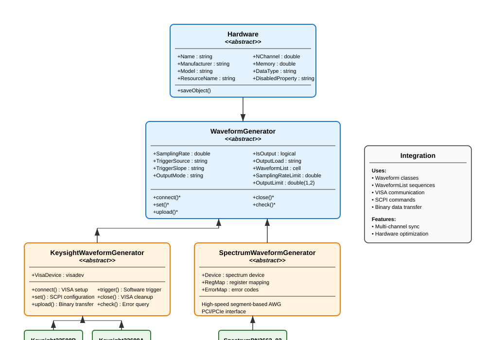

Waveform Generator
==================

The **WaveformGenerator** framework provides comprehensive hardware control for arbitrary waveform generators (AWGs) in experimental setups. This system bridges the software waveform generation capabilities with physical hardware devices, enabling precise control of experimental timing and signal generation.

Overview
--------

The WaveformGenerator framework consists of several layers:

- **Hardware abstraction**: Common interface for all AWG devices
- **Vendor-specific implementations**: Keysight and Spectrum AWG support
- **SCPI/driver integration**: Direct hardware communication protocols
- **Waveform upload and sequencing**: Efficient transfer of complex waveform sequences
- **Trigger and synchronization**: Precise timing control for experimental coordination

The framework seamlessly integrates with the :class:`Waveform` and :class:`WaveformList` classes to provide end-to-end signal generation capabilities.

Class Hierarchy
---------------

The WaveformGenerator system follows a hierarchical design pattern:

Hardware Base Class
-------------------

All waveform generators inherit from the :class:`Hardware` base class, which provides common functionality for instrument control:

**Core Properties:**

- :attr:`Name`: Device nickname for identification
- :attr:`Manufacturer`: Vendor name (e.g., "Keysight", "Spectrum")
- :attr:`Model`: Specific model number
- :attr:`ResourceName`: VISA or connection resource identifier
- :attr:`NChannel`: Number of output channels
- :attr:`Memory`: Available sample memory in points
- :attr:`DataType`: Sample data format ("uint8" or "double")

**Common Workflow:**

All AWG classes follow the same operational sequence:

.. code-block:: matlab

   % 1. Create and configure the AWG
   awg = Keysight33500B("TCPIP0::192.168.1.100::inst0::INSTR", name="MainAWG");
   
   % 2. Connect to the hardware
   awg.connect();
   
   % 3. Configure settings
   awg.set();
   
   % 4. Upload waveforms
   awg.upload();
   
   % 5. Check status
   status = awg.check();
   
   % 6. Close connection when done
   awg.close();

WaveformGenerator Abstract Base
-------------------------------

The :class:`WaveformGenerator` abstract class extends :class:`Hardware` to provide AWG-specific functionality:

**Configuration Properties:**

- :attr:`SamplingRate`: Per-channel sampling rate in Hz
- :attr:`TriggerSource`: "External", "Software", or "Immediate"
- :attr:`TriggerSlope`: "Rise" or "Fall" edge triggering
- :attr:`OutputMode`: "Normal" or "Gated" output mode
- :attr:`IsOutput`: Per-channel output enable flags
- :attr:`OutputLoad`: "50" ohm or "Infinity" (high impedance)
- :attr:`WaveformList`: Cell array of :class:`WaveformList` objects per channel

**Hardware Limits:**

- :attr:`SamplingRateLimit`: Maximum supported sampling rate
- :attr:`OutputLimit`: [min, max] output voltage range at 50Ω load

**Abstract Methods:**

All concrete AWG implementations must provide:

- :meth:`connect()`: Establish device connection
- :meth:`set()`: Apply configuration settings
- :meth:`upload()`: Transfer waveforms to device memory
- :meth:`check()`: Query device status and errors
- :meth:`close()`: Clean shutdown and disconnect

Keysight AWG Implementation
---------------------------

The Keysight implementation supports VISA-based AWGs using SCPI commands:

KeysightWaveformGenerator Base
^^^^^^^^^^^^^^^^^^^^^^^^^^^^^^

Provides common SCPI functionality for all Keysight AWGs:

**Connection Management:**

.. code-block:: matlab

   awg = Keysight33500B("TCPIP0::192.168.1.100::inst0::INSTR", name="AWG1");
   awg.connect();  % Opens VISA session

**Configuration:**

.. code-block:: matlab

   % Multi-channel configuration
   awg.SamplingRate = [250e6, 100e6];        % Different rates per channel
   awg.TriggerSource = ["External", "Software"];
   awg.TriggerSlope = ["Rise", "Fall"];
   awg.OutputMode = ["Normal", "Gated"];
   awg.OutputLoad = ["50", "Infinity"];
   awg.IsOutput = [true, false];             % Enable only channel 1
   
   awg.set();  % Apply all settings

**Waveform Upload Process:**

The upload process handles complex waveform sequences automatically:

.. code-block:: matlab

   % Create waveforms
   sine1 = SineWave(frequency = 1000, amplitude = 1.0, duration = 0.01);
   ramp1 = LinearRamp(startValue = 0, stopValue = 2, rampTime = 0.005);
   
   % Create waveform list
   sequence = WaveformList("ExperimentSequence", ...
                           waveformOrigin = {sine1, ramp1}, ...
                           samplingRate = 250e6);
   
   % Assign to AWG channel
   awg.WaveformList{1} = sequence;
   
   % Upload with automatic scaling and triggering
   awg.upload();

**Advanced Features:**

- **Automatic scaling**: Waveforms are scaled to utilize full DAC range
- **Trigger insertion**: Leading/trailing zeros added for clean triggering
- **Sequence management**: Complex multi-segment sequences supported
- **Binary transfer**: Efficient SCPI binary block transfers
- **Error handling**: Automatic error detection and recovery

Keysight33500B Specific
^^^^^^^^^^^^^^^^^^^^^^^

Concrete implementation for the Keysight 33500B series:

.. code-block:: matlab

   awg = Keysight33500B("TCPIP0::192.168.1.100::inst0::INSTR", name="33500B_Main");
   
   % Device specifications automatically configured:
   % - 2 channels
   % - 250 MHz sampling rate per channel
   % - 16 MB memory
   % - ±10V output range at 50Ω

**Typical Usage Example:**

.. code-block:: matlab

   % Complete experimental sequence
   awg = Keysight33500B("TCPIP0::192.168.1.100::inst0::INSTR", name="ExpAWG");
   awg.connect();
   
   % Configure for external triggering
   awg.TriggerSource = ["External", "External"];
   awg.OutputMode = ["Gated", "Normal"];
   awg.set();
   
   % Channel 1: Control voltage sequence
   initRamp = LinearRamp(startValue = 0, stopValue = 5, rampTime = 0.1);
   holdConst = ConstantWave(amplitude = 5.0, duration = 2.0);
   finalRamp = LinearRamp(startValue = 5, stopValue = 0, rampTime = 0.2);
   
   controlSeq = WaveformList("ControlSequence", ...
                             waveformOrigin = {initRamp, holdConst, finalRamp});
   awg.WaveformList{1} = controlSeq;
   
   % Channel 2: Modulated RF signal
   carrier = SineWave(frequency = 1e6, amplitude = 1.0, duration = 2.3);
   modulator = SineWave(frequency = 1000, amplitude = 0.3, duration = 2.3);
   
   rfMod = SineWaveModulated(frequency = 1e6, amplitude = 1.0, duration = 2.3);
   rfMod.AmplitudeModulation = WaveformList("AM_Mod", waveformOrigin = {modulator});
   
   awg.WaveformList{2} = WaveformList("RF_Channel", waveformOrigin = {rfMod});
   
   % Upload and start
   awg.upload();
   
   % Software trigger if needed
   awg.trigger();
   
   % Monitor status
   if awg.check()
       disp('AWG operating normally');
   end
   
   % Clean shutdown
   awg.close();

Spectrum AWG Implementation
---------------------------

The Spectrum implementation provides high-speed AWG control for Spectrum Instrumentation cards:

SpectrumWaveformGenerator Base
^^^^^^^^^^^^^^^^^^^^^^^^^^^^^^

Provides driver integration for Spectrum AWGs:

**Key Features:**

- **High-speed operation**: Up to 1.25 GS/s sampling rates
- **Large memory**: Multi-gigasample memory capacity
- **PCI/PCIe interface**: Direct computer integration
- **Segment-based sequencing**: Hardware-optimized waveform management
- **16-bit DAC resolution**: High dynamic range output

**Driver Requirements:**

The Spectrum implementation requires the vendor MATLAB driver:

.. code-block:: matlab

   % Ensure Spectrum driver is on MATLAB path
   addpath('C:\SpectrumDriver\MATLAB');
   
   awg = SpectrumDN2662_02("PCI::SPCM0", name="SpectrumAWG");

**Segment Management:**

Spectrum AWGs use segment-based waveform storage:

.. code-block:: matlab

   % All enabled channels must have equal segment counts
   awg.IsOutput = [true, true];
   
   % Each channel gets identical segment structure
   sine1 = SineWave(frequency = 100e6, amplitude = 1.0, duration = 1e-6);
   sine2 = SineWave(frequency = 150e6, amplitude = 0.8, duration = 1e-6);
   
   awg.WaveformList{1} = WaveformList("Ch1_Seq", waveformOrigin = {sine1});
   awg.WaveformList{2} = WaveformList("Ch2_Seq", waveformOrigin = {sine2});

SpectrumDN2662_02 Specific
^^^^^^^^^^^^^^^^^^^^^^^^^^

High-speed 2-channel AWG configuration:

.. code-block:: matlab

   awg = SpectrumDN2662_02("PCI::SPCM0", name="HighSpeedAWG");
   
   % Device specifications:
   % - 2 channels
   % - 1.25 GS/s sampling rate
   % - 2 GB memory
   % - 80 mV to 2V output range at 50Ω

**High-Speed Applications:**

.. code-block:: matlab

   % High-frequency signal generation
   awg = SpectrumDN2662_02("PCI::SPCM0", name="RFGenerator");
   awg.connect();
   
   % Configure for maximum speed
   awg.SamplingRate = [1.25e9, 1.25e9];
   awg.set();
   
   % High-frequency waveforms
   rf_signal = SineWave(frequency = 100e6, amplitude = 1.0, duration = 10e-6);
   chirp = LinearFrequencyRamp(startFreq = 50e6, stopFreq = 200e6, ...
                               amplitude = 0.8, duration = 5e-6);
   
   % Upload high-speed sequence
   awg.WaveformList{1} = WaveformList("HighSpeed", waveformOrigin = {rf_signal, chirp});
   awg.upload();

Advanced Features
-----------------

Multi-Channel Synchronization
^^^^^^^^^^^^^^^^^^^^^^^^^^^^^

Synchronize multiple channels for complex experimental protocols:

.. code-block:: matlab

   awg = Keysight33500B("TCPIP0::192.168.1.100::inst0::INSTR", name="SyncAWG");
   awg.connect();
   
   % Synchronized trigger configuration
   awg.TriggerSource = ["External", "External"];
   awg.TriggerSlope = ["Rise", "Rise"];
   awg.set();
   
   % Phase-coherent signals
   sine_0 = SineWave(frequency = 1000, amplitude = 1.0, phase = 0, duration = 0.1);
   sine_90 = SineWave(frequency = 1000, amplitude = 1.0, phase = pi/2, duration = 0.1);
   
   awg.WaveformList{1} = WaveformList("Phase_0", waveformOrigin = {sine_0});
   awg.WaveformList{2} = WaveformList("Phase_90", waveformOrigin = {sine_90});
   
   awg.upload();

Hardware-Optimized Sequences
^^^^^^^^^^^^^^^^^^^^^^^^^^^^

Utilize hardware repeat capabilities for efficient long sequences:

.. code-block:: matlab

   % Long periodic sequence with hardware optimization
   shortPulse = TrapezoidalPulse(amplitude = 2.0, riseTime = 1e-6, ...
                                 holdTime = 10e-6, fallTime = 1e-6);
   
   optimizedSeq = WaveformList("Optimized", ...
                               waveformOrigin = {shortPulse}, ...
                               nPeriodPerCycle = 100, ...      % Hardware repeats
                               isTriggerAdvance = true);       % Trigger advance mode
   
   awg.WaveformList{1} = optimizedSeq;
   awg.upload();

Error Handling and Diagnostics
^^^^^^^^^^^^^^^^^^^^^^^^^^^^^^

Robust error detection and recovery:

.. code-block:: matlab

   try
       awg.upload();
       
       % Verify successful upload
       if awg.check()
           disp('Upload successful');
       else
           warning('Hardware error detected');
           awg.set();  % Attempt recovery
       end
       
   catch ME
       warning('Upload failed: %s', ME.message);
       awg.close();
       rethrow(ME);
   end

**Status Monitoring:**

.. code-block:: matlab

   % Continuous monitoring during experiment
   while experimentRunning
       if ~awg.check()
           warning('AWG error detected, attempting recovery');
           awg.set();
           awg.upload();
       end
       pause(1);  % Check every second
   end

Memory Management
^^^^^^^^^^^^^^^^^

Efficient use of device memory for large sequences:

.. code-block:: matlab

   % Check memory constraints
   awg = Keysight33500B("TCPIP0::192.168.1.100::inst0::INSTR", name="MemTest");
   maxSamples = awg.Memory;  % 16 MB = 16e6 samples
   
   % Calculate sequence memory requirements
   totalSamples = sum(cellfun(@(x) x.NSample, awg.WaveformList));
   
   if totalSamples > maxSamples
       warning('Sequence too large for device memory');
       % Implement downsampling or segmentation
   end

Best Practices
--------------

**Device Configuration:**
- Always call :meth:`connect()` before other operations
- Use :meth:`check()` to verify successful operations
- Call :meth:`close()` for clean shutdown

**Waveform Design:**
- Match sampling rates between waveforms and hardware
- Consider hardware memory limitations for long sequences
- Use hardware optimization features for repetitive patterns

**Synchronization:**
- Use external triggering for multi-device synchronization
- Configure trigger slopes consistently across channels
- Allow sufficient trigger setup time

**Error Recovery:**
- Implement try-catch blocks for critical operations
- Use status checking for continuous monitoring
- Have recovery procedures for common error conditions

**Performance Optimization:**
- Use binary data transfer modes when available
- Minimize waveform uploads during experiments
- Cache frequently used waveform sequences

The WaveformGenerator framework provides a powerful, flexible interface for controlling arbitrary waveform generators in experimental setups. The object-oriented design ensures extensibility for new hardware while maintaining consistent operation across different vendors and models.
